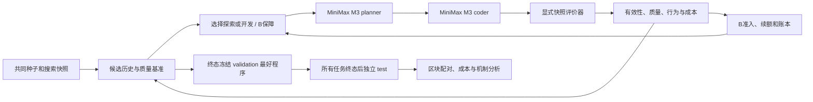

# 第六章 S3：已实现架构、研究假设与技术路线

版本依据：`chapter6-s3-tsp-r3-frozen-20260927`，冻结提交 `62cf707`。本文说明实际代码，不把未来的关系图、witness、模块级算法发现或 MLE-Bench 接入写成已有功能。效果结论以独立结果报告为准。

## 1. 科学问题与前章承接

本章研究的是外层程序搜索：生成新构造规则、选择某条程序分支、修改规则、评价执行结果、保留或结束其开发资格。内层 TSP 路线只是程序行为的观测。多个代码文本、多个 planner 标签或多条路线都不能直接证明发现了真实算法模式。

核心问题为：**有限执行证据和总预算下，质量暂时落后但行为不同的程序，能否通过有上限的后续开发产生值得其成本的收益？反馈协调是否进一步改善搜索？** 最终输出可以是单个最佳程序。

| 前序章节 | 对应文章/工作 | 第六章承接与重新验证的内容 |
|---|---|---|
| 第一、二章 | 绪论与多模态优化基础，无独立指定论文 | 定义多模态、搜索分布、评价和预算 |
| 第三章 | *A Review of Evolutionary Algorithms for Multimodal Multi-objective Optimization: Mechanisms, Progress, and Prospects*；*A Parameter-Free Joint-Space Metric for Multimodal Multiobjective Optimization* | 将质量、执行行为和成本分别评价；程序空间没有完整参考模式集，不能把档案数解释成模式召回 |
| 第四章（离散） | *A Multi-Strategy Local Search Memetic Algorithm for Multimodal Traveling Salesman Problem*，MSLS-MA | 多结构保留和局部开发；本章搜索对象是规则而非单条路线，不能直接继承前章有效性 |
| 第四章（连续） | *Relational-Memory State-Driven Restart Allocation for Multimodal Optimization*，RMC-CMSA | 根据实际搜索过程、终端和成本分配资源；当前实现没有完整关系转移模型 |
| 第五章 | *High-Dimensional Multimodal Multi-Objective Optimization via Subspace Projection and Angular Diversity Management*，HDADE | 分别描述质量与结构；本版本没有投影或角度多样性机制，不能宣称已经迁移其全部算法 |

原始材料在 [papers](../../papers/)。第三章测试问题设计等既有缺口以[总技术报告](../report/博士论文总体架构与第六章技术报告.md)为准。上述关联解释研究动机，不构成第六章的新颖性证明。

## 2. 搜索空间与评价对象

程序为受限 Python 函数 `priority(f)`，每次选取得分最高的下一城市。规则只能读取八种归一化几何/构造特征，不能访问实例编号或参考最优值。解释器限制语法，禁止任意导入、文件和网络访问。

所有方法使用同一构造器，并进行固定的 24 次 2-opt delta 检查。每个程序的 validation 损失为 36 个 TSP14 实例的平均

\[
L(p)=\frac{1}{36}\sum_x\left(\frac{\operatorname{length}(p,x)}{\operatorname{OPT}(x)}-1\right).
\]

14 城市参考值由 Held–Karp 精确计算。每块有 12 个 probe、36 个 validation 和 60 个 test 实例，各包含 uniform、clustered、grid 三类。三条共同种子为 nearest-neighbor、return-aware、regret-aware。最终程序和种子基线均由 validation 选定，再独立测试。

在 probe 上记录路线无向边集合，以平均 Jaccard 距离比较执行行为。当前方向划分为在线最近成员关联：距离不超过 0.08 则加入既有方向，未匹配则创建新方向；平局按稳定方向 ID 处理。它不合并连通分量，不具备真实盆地识别保证，且依赖到达顺序。

## 3. 实际状态分工

| 状态 | 代码中的内容 | 作用 |
|---|---|---|
| 候选历史 C | 所有种子、程序、父代、参考、评价、代码身份 | 追溯、最佳程序选取和共同参考规则 |
| B | 最多六个方向条目，代表程序、剩余额度、创建顺序 | 提供可实际选作父代的开发入口 |
| 方向/账本 | 行为成员、方向 ID、lineage ID、累计授予和已用槽位 | 防止同一账本因重复入池无限续额 |
| M | 逐次决策、执行反馈、全局/父代/方向改进、成本、失败 | 可审计调度与 AD 反馈 |
| 输出 A | 搜索结束后由历史构造的质量约束行为代表摘要 | 结果描述；当前不作为在线父代选择的唯一入口 |

W、标签频率评分、witness 和完整关系图不参与本版控制器。所有组使用相同参考选择规则，但各组历史因搜索路径不同而不同。内部概率、保护开关、池规模不进入模型提示；实际父代、参考、目标标签和操作可以改变提示。

## 4. 准入、续额与保护

设共同最好种子损失为 \(L_0\)。有效且 \(L(p)\le L_0+0.035\) 的候选才有竞争资格。候选若与已知程序同时具有完全相同的 probe 行为和 validation 损失向量，标记为观测重现，不续额。这个判断不是语义等价证明。

符合质量条件的新行为方向可获得两次 B 开发资格，**不要求父代存在**。已有方向只有代表改善超过 0.0001 时才可续额。两组均按同样规则授予资格，单账本累计授予不超过八次。一次无效输出仍消耗一个提案槽位，没有免费修复调用。

新变异方向继承父方向账本；返回已有方向使用其已有账本。这里的八次上限作用于方向账本分配的 B 槽位，不是整个程序父子树、或所有 incumbent 开发的总次数上限。未知程序空间不能据此得到全局覆盖保证。

FB_U 的普通开发使用 B 的最老可用条目，无条目时选当前最好程序；满池时可以淘汰尚未用完资格的条目。FB_P 的共同普通规则相同，额外优先执行未兑现保护槽位，并禁止淘汰仍有保护额度的条目。FIFO 以条目创建顺序耗尽资格，不是轮转。

因此，FB_P−FB_U 检验“调度优先和防淘汰组成的最低机会保障”，不是分支池存在与否，也不能分别归因于这两项子机制。总预算不足时仍可能留下未兑现额度，结果必须报告这一部分。

## 5. 五策略与六个实验组

SP 始终修改当前最好程序；WR 每步无父代探索。FB 使用固定 0.5 的普通开发概率，拆为 FB_U 与 FB_P 两组；TS_P 的普通开发概率按提案进度从 0.15 升到 0.85；AD_P 根据普通探索/开发的直接反馈更新概率。三个 P 组使用完全相同的保护和 B 排序。

AD 的一个单元由两个普通提案构成。对每个提案，记录其发生前后全局 validation 最好的下降量；单元收益为这两个直接下降量之和除以其实际 token/1000。插入的保护步骤不计入单元的步数、收益和成本，但计入全任务预算。初始化以随机顺序完成一次探索单元和一次开发单元，再取各动作完整单元收益的算术均值 \(\bar r_E,\bar r_D\)：

\[
P(D)=0.5+0.25\,\operatorname{clip}\left(
\frac{\bar r_D-\bar r_E}{0.001+|\bar r_D|+|\bar r_E|},-1,1\right).
\]

没有足够用量证据时回退到 0.5。该概率不是经校准的成功率，也没有估计探索方向的延迟价值。**AD 对 FB 的比较同时改变反馈和两步动作组织，不能单独证明“反馈信息本身”有效。** 若要做此主张，还需相同两步组织、固定概率的控制组和反馈打乱对照。

## 6. 技术流程

每次请求先落盘，再发送一次，原始响应先持久化再解析。程序决策、候选和 checkpoint 保持绑定。程序评价显式传入快照；执行器没有全局数据切换，每次保存快照哈希和实例 ID。六个工作进程互相独立。

达到预算或服务失败时，冻结已完成候选中的最好程序作为可用输出，并标注状态。请求用量未知时报告已知成本下界。输入 token 采用字节数预留估计，再核查实际用量；不能把该估计表述为供应商分词的数学上界。

## 7. 证据与实验边界

本轮冻结为 MiniMax M3 × 六组 × 八个新区块（32–39）= 48 次，每次最多 32 提案、64 请求、300,000 token 和 3,600 秒。统一上限不等于相同实际 token 预算消耗。单位是数据块，不是 API 请求、候选或测试实例。

主要比较为 FB_P−FB_U、TS_P−FB_P、AD_P−FB_P；SP 和 WR 界定两个极端策略。报告全八块差值和区块 bootstrap 描述性区间。0.3 个百分点质量收益、10% token 增幅是筛查参考，不是统计功效保证或确认性显著门槛。

r1 因反馈/对照语义审计停止；r2 因线程并行与全局评价器冲突作废。其全部原始调用、成本、中止和未运行任务独立保留，不用于效果平均。r3 的 85 项回归检查是工程证据，真实搜索和独立测试才是方法效果证据。

当前只覆盖 TSP14、单模型、受限评分规则空间。没有完成 50/100 城市模块空间、第二任务、MLEvolve 同预算对照、同状态的新模型分叉搜索或确认性样本量实验。最终章节创新应由可复现效果和机制归因决定；完整关系记忆、多 agent 分工、API 接通与日志工程不单独构成学术创新。
