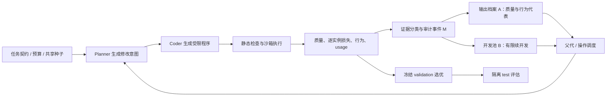

# 第六章 v1.2 架构：有限分支开发

**状态：** 本文描述已经实现并完成机制筛查的架构。实验支持“局部改进可以被保留并获得后续执行机会”，尚不支持关系引导比固定开发更有效，也不支持完整方法稳定优于 niche。

结果见[中文技术报告](../../experiments/chapter6/v12/results/screening-20260924-r2/TECHNICAL_REPORT_ZH.md)、[冻结协议](../../experiments/chapter6/v12/preregistration.md)和[实验说明](../../experiments/chapter6/v12/README.md)。

## 研究定位

第六章把前几章的多模态优化研究提升到“搜索能够产生算法的程序空间”。第三章的质量与分布联合评价、第四章 MSLS-MA/RMC-CMSA 对局部开发和多解维护的经验、第五章 HDADE 对目标质量与决策空间差异的分别处理，为问题建模提供依据。迁移到程序发现后，程序行为由有限执行证据估计，模型生成又带来随机性和调用成本，因此不能把多个不同代码文件直接等同于多个有效算法模式。

本章当前聚焦的可证伪问题是：**在固定提案预算下，如何将相对父代的真实质量改进转成受限的后续开发机会；关系证据是否能比同等机会的简单固定开发调度带来增量？** 要区分三个事件：候选比父代好、候选只是重现已知高质量行为、候选增加算法集合的可用价值。v1.2 实现前两者的操作性审计与有限续开发；第三者的跨实例用途尚未通过选择器实验验证。

## 数据流和模块

### 任务契约与程序生成

任务配置固定程序接口、允许调用的特征、候选预算、初始规则、数据划分及相同的 planner JSON schema。Planner 选择目标策略族、父代、参考对象和操作；Coder 负责实现该修改。提示不暴露控制器名称，但父代、目标族和操作会依策略决策变化，因此这不是让模型看到完全相同上下文的反事实实验。

### 执行与证据分类

每个候选在固定 probe 和 validation 上执行，记录合法性、平均损失、逐实例损失向量、行为描述、资源使用和相对父代改变量。v1.2 用互斥标签记录已知规则重现、竞争性局部改进、无父代增益的新行为、低质量新行为、低质量重复、无收益重复及其他有效候选。标签是有限样本下的审计定义，不是程序语义等价结论。

质量比较使用共享参考和容差；父代改进要求超过预设的实际差异阈值。已知规则重现要求 probe 行为和逐实例 validation 损失向量都精确相同。这个规则让已知重复不能重置开发预算，但无法排除未观测实例上的差异。

### 三类状态

| 状态 | 保存和用途 | v1.2 的实现边界 |
|---|---|---|
| A：输出档案 | 保存质量可接受的行为代表；供最终选优、输出和一般父代选择 | 继承基础搜索状态中的质量/行为过滤；代表数不被解释为真实模式召回率 |
| B：开发池 | 保存少量有竞争力且相对父代改善的候选；为它们提供后续修改机会 | 容量 3，每个分支至多 2 个续提案；新候选只有再次改善父代才能延长开发链；到期不能靠重新发现签名续期 |
| M：证据与审计 | 保存候选分类、亲子关系、开发机会、有效性、改进幅度、深度、token 等事件 | 采用事件日志与标签统计；没有完整的父代×操作×终端关系图，也没有经校准的置信关系模型 |

W（中间搜索轨迹）不在 v1.2 架构内。只有未来实验证明 W 在父代、终端行为、质量和成本之外有增量预测/决策价值，才加入核心系统。独立 witness 也尚未实现；当前 probe/validation 签名只是一种有限观测下的重复定义。

### 开发池准入与调度

候选只有满足以下条件才可进入 B：程序有效；质量处于当前最佳程序的预设容差内；相对实际父代有足够改进；并且没有精确重现已观察规则。niche 组不创建 B。两个开发组使用相同准入条件和池容量，以便将“获得固定开发机会”与“关系证据怎样选择开发分支”分开。

| 控制器 | 开发时隙规则 | 研究用途 |
|---|---|---|
| `niche` | 仅从常规档案选择，不启用 B | 无续开发机会参照 |
| `niche_fixed_dev` | 有可开发分支时，每隔一个 proposal slot 按 FIFO 选择 | 强简单基线：相同开发机会，固定调度 |
| `relational_branch` | 在同一批保留时隙中依据策略族统计和分支局部收益选择 | 检验关系/收益调度是否优于固定机会 |

池满时淘汰收益/已使用机会最低的分支，并用进入时间作确定性平局规则。每个被分配到 B 的 proposal slot 在候选返回并评价后扣除一次机会，失败输出也消费预算。只有续开发子代再次达到准入条件，才沿该分支增加深度。

## 实验设计与已有证据

冻结筛查包含两个模型端点、三个配对区块和三个控制器，共 18 次运行；每次 8 个 proposal slots。任务为 14 城市欧氏 TSP，probe/validation/test 各为 12/36/60 个互不重叠实例。测试指标是 validation 选择的单程序在 test 上相对精确最优解的 gap。r1 因 niche 基线错误建立 B 池而作废，r2 是唯一进入结果分析的批次。

r2 中分支池产生 30 次后续评价，30 个子代有效，其中 6 个优于各自父代；两个模型各有 15 个有效分支子代。预注册机制触发条件通过。这证明了“识别竞争性局部进步—保存分支—真实安排后续模型提案—评价子代”的执行链可运行。

测试质量并未显示关系调度的优势：关系分支的平均 test gap 为 6.379%，固定开发为 5.569%，niche 为 5.759%；关系分支相对固定开发的配对平均差为 +0.811 个百分点，六个配对中仅一个更低。三个区块/模型的筛查不具确认性统计能力。结论应表述为：**机制已触发，关系引导的增量性能尚未建立，当前结果方向上不利于该调度规则。** 不得把它写成完整方法有效或博士创新已确立。

## 面向论文的技术路线

1. 保留 v1/v1.1 作为失效动机：碰撞与全局改进信号会掩盖分支内进展，质量保护若只改统计信用也不保证实际开发。
2. 以 v1.2 作为最小机制验证：A 与 B 分离，B 有固定容量、固定续开发额度、不可续期的已知规则重复识别，并用固定开发臂作强基线。
3. 分析关系臂没有超过固定基线的原因：检查关系评分、标签稀疏性、分支淘汰和机会分配，再决定保留或删除关系调度。
4. 扩展到更多独立区块和至少一个有区分力的第二任务，固定预算与运行顺序，预注册任务级主要效应和非劣界。
5. 验证集合用途时，独立训练选择器并加入初始规则集、固定容量组合器、单规则及 test oracle 上界；选择器必须在冻结 test 上一次性评价并计入成本。
6. 只有核心质量/用途结果通过后，再测试独立 witness、关系图或 W。每个模块需超过同信息、同成本的简单基线，否则从最终方法中删除。

## 版本验收门槛

| 阶段 | 必需证据 | 当前状态 |
|---|---|---|
| 决策机制正确 | 单元 fixture 通过，niche 不误启用 B，预算和父代决策可回放 | 已通过 |
| 真实模型机制触发 | 预设数量的续开发提案实际发出并评价，usage 与日志完整 | r2 已通过 |
| 关系调度有增量 | 在配对、同预算、独立区块上优于 niche+fixed development，且无重要质量退化 | 未通过；本轮观测方向不利 |
| 多模态输出有用途 | 独立 selector/组合器改善新实例表现，相对共享种子算法集有增量 | 未检验 |
| 博士章节贡献成立 | 多任务确认、强基线、成本公平、可复现结果与近邻差异证据 | 未成立，仍需研究 |

当前最稳妥的章节题目是：**《有限执行证据下自动算法发现的质量保护与分支开发机制》**。若后续关系调度不优于固定开发，章节仍可形成严谨的机制比较与失效边界研究，但不能宣称关系记忆是有效创新；是否足以满足博士论文贡献要求，需要看扩展实验和学校的学位标准。
