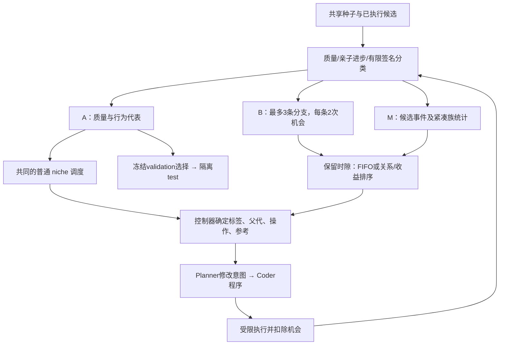

# 第六章架构：有限证据下的分支保留与开发

**2026-09-25 补充：** [v1.2.2 启动准备](V122_READINESS.md)已为下述两臂控制器加入专用入口、恢复和测试隔离；本页保留下述 v1.2.1 机制定义。新在线搜索仍未执行。

**2026-09-24 状态：** r2 的 18 次历史模型搜索证明执行链可以运行；v1.2.1 修正了调度对照并完成离线机制验证。本轮新增模型调用为 0，未开展 16 次或 40 次新搜索。关系排序的独立性能效果和算法集合用途仍未建立。

| 版本 | 实际实现 | 证据及解释 |
|---|---|---|
| v1/v1.1 | 主要在标签上记录信用，A 同时承担输出与父代来源 | 局部信用不保证对应分支实际得到开发 |
| v1.2 r2 | 分离 A/B；固定臂普通调度为 niche，关系臂为 relational，继承 W 引用 | 30 次续开发、6 次父代改进；比较混杂，不能归因于 B 内排序 |
| v1.2.1 | 两开发臂共用普通 niche，只改变 B 内排序；W 不参与决策 | 确定性测试及同历史决策探测；没有本版模型搜索结果 |

历史[结果包](../../experiments/chapter6/v12/results/screening-20260924-r2/README.md)、当前[离线报告](../../experiments/chapter6/v12_1/results/mechanism-only-20260924/REPORT_ZH.md)、[未来协议草案](../../experiments/chapter6/v12_1/preregistration.md)分别对应不同证据阶段。r2 冻结源码和旧标签保持不变。

## 研究定位与前章联系

当前核心问题是：**有限执行证据下，如何区分已知行为重现与可继续开发的局部改进，并在固定预算下保存和利用后者？** 父代改进、重现已知好规则、增加算法集合用途是三个不同事件。关系/收益排序是待验证模块。

第三章的综述与 DWD 指标支撑质量、分布与机制的分别评价；第四章 MSLS-MA 支撑模式内开发与多解保留，RMC-CMSA 支撑根据实际搜索过程和结果分配资源；第五章 HDADE 支撑目标质量与决策差异的分别维护。外层轨迹是“父程序—代码修改—子程序”，内层轨迹是求解单个实例的路线过程。二者不能混称为同一搜索记忆。

当前只在受限评分程序和小型 TSP 上验证机制，没有实现一般机器学习训练管线。不同程序或 probe 代表数不是完整程序空间的模式召回率。

## v1.2.1 数据流

Planner 根据控制器已选定的上下文提出公式/修改意图，不能把控制器决策写成模型自主决定。图中的生成接口沿用已有系统；当前 v1.2.1 离线夹具用构造历史或已归档候选替代新模型生成，没有接入新的在线启动器。

## 状态、准入与预算

| 状态 | 用途 | 约束 |
|---|---|---|
| A | 质量合格的行为代表；普通父代与参考来源 | 继承共同的质量/行为过滤；不代表已知完整模式集 |
| B | 临时保留有竞争力的父代改进，兑现后续修改机会 | 容量3，每条2次；失败/重复子代同样扣除被选父代的机会 |
| M | 事件、有限策略族历史、分配理由 | 不是完整条件转移图，不声称校准置信概率 |
| W | r2 继承的内层轨迹档案 | v1.2.1 清空该档案，选择只来自 A/B；节点内的轨迹诊断仍存档 |

候选需有效、相对实际父代改善大于 `1e-4`、损失不高于此前最优值加 `0.035`，且未同时精确重现已有 probe 行为与 validation 损失向量，才有 B 准入资格。精确重现只是有限观测定义。池满时优先移除耗尽条目，否则移除 `parent_gain/(1+attempts)` 最低条目；平局移除更新条目。区分“准入合格”和“实际保留”，避免入池后立即被淘汰还被计作受保护。

同一节点不能重复扣款；allocation 必须对应实际父代和剩余额度。观察到子代后才扣一次机会；生成失败用无效候选记录消费，不能用重新选择覆盖未完成提案。新签名的持续改进可以开启新条目，整个过程仍受总提案预算限制。

成功深度由连续**实际入池**的父代改进链决定，首个入池候选深度1；保存祖先深度以免池淘汰丢失谱系。尝试深度是所选父代成功深度加1；失败尝试不增加成功深度。不再输出含义混合的 `branch_development_max_depth`。

## 唯一处理因素：B 内排序

两个开发臂的每个步骤都执行相同普通 niche 路径和相同随机数消耗。在从0起算的奇数提案时隙且 B 非空时覆盖普通选择：父代取 B、操作统一 refine、参考统一为空、目标标签取所选分支。新标签本身不触发重启；继承的周期重启/重组在两臂完全相同。

- 固定臂：严格按创建顺序 FIFO，耗尽最老条目后再开发下一条；这与 r2 的可用集合索引轮转不同。
- 关系臂：对同一可用集合计算 `S(b)=q(tag_b)+0.25*parent_gain_b/(1+attempts_b)`。
- `q(t)=(1+s_t)/(2+n_t)`，`s_t` 为该族满足竞争性父代改进且非已知重现的次数。只统计已评价的 live 候选，包含无效/重复结果作为未取得新进步的观察；该族不足2次时退回全部族的共同统计。两臂都计算并存档统计，只有选择规则不同。

这是**族证据与局部收益的组合启发式**。它不是完整的关系记忆，也不能用优于 FIFO 的结果单独证明“关系信息有效”。未来需增加仅按收益/使用次数排序及打乱族证据的控制。所有评分/开关仅写审计；模型侧 evidence 始终只有 `decision_step`，没有控制器名。

同历史、同随机状态下，普通步骤及完整提示应相同；B 父代改变后后续真实生成历史自然可能分化。不能要求或声称独立搜索全过程的提示相同。

## 已有证据和限制

r2 测试 gap：niche 5.759%、固定开发5.569%、关系开发6.379%。30 个续开发子代中6个改进父代，5个同时改进当时全局 validation 最优。关系臂3/6运行无入池，25次重启、23次指向未尝试标签，28次仅来自W的引用，只有4个时隙有多个可选分支。最大成功深度为3，旧混合字段最大值4。以上均为旧结果的事后诊断。

v1.2.1 在144个已归档历史位置作决策探测：普通选择144/144一致，非开发完整提示90/90一致，B父代12次不同。探测向两臂喂入相同历史候选，没有生成其反事实子代，不能从中推断质量提升。

| 待证命题 | 状态 |
|---|---|
| 有限分支开发能实际执行 | r2 已触发 |
| 修正版能隔离分支选择因素 | 离线机制测试通过 |
| 修正版关系/收益排序优于 FIFO | 未开展新搜索，未知 |
| 关系信息有独立增量 | 还缺收益/使用次数排序对照 |
| 多算法集合有可部署用途 | 还缺独立训练且冻结的选择器与初始/同容量集合基线 |
| 具备博士章节所需创新和稳定优势 | 尚未建立 |

下一步仅准备16次针对性搜索草案，使用两个开发控制器、两个模型和四个全新区块；按模型×控制器报告触发与可选择机会。不因零质量改进排除运行，不把合计触发数当作各单元充分检验。不在本轮增加模型调用。近期题目收敛为**《有限执行证据下自动算法发现的质量保护与分支开发机制》**。
