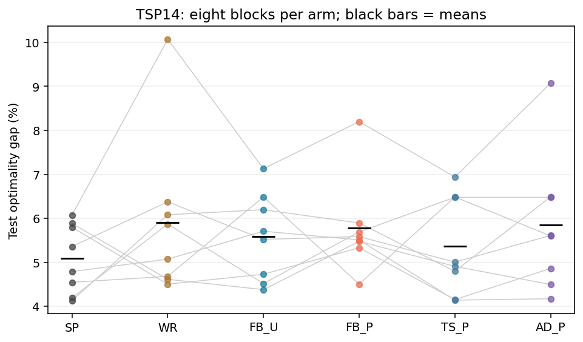
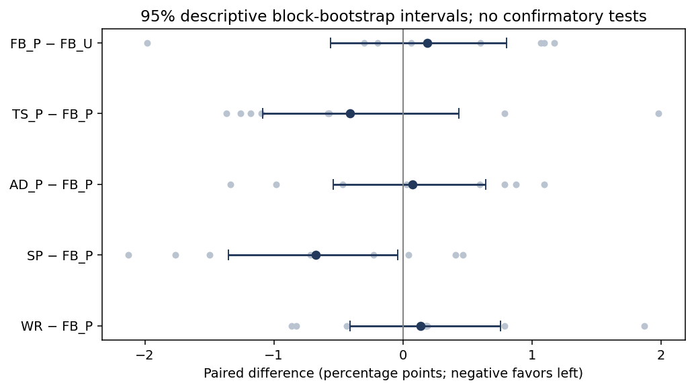
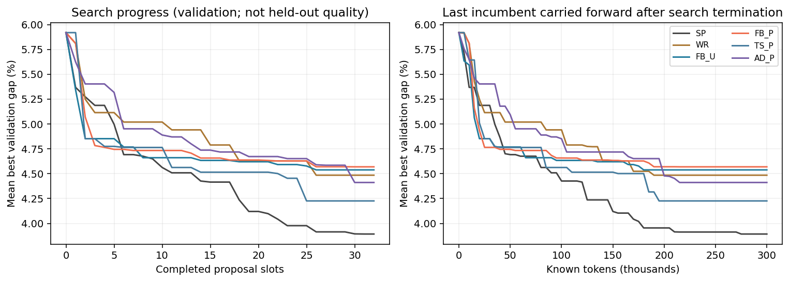

# S3 r3 完整技术报告：方向试用、有限保护与探索—开发协调

日期：2026-09-27。真实搜索源码为 51e5d5e，协议冻结提交为 62cf707，标签为 chapter6-s3-tsp-r3-frozen-20260927。独立规模迁移评价在 343b13f / chapter6-s3-transfer-frozen-20260927 冻结，早于本轮任何 test 读出。结果版本另行提交、打标签，不移动上述标签。

## 1. 本轮结论

**本轮已完整执行 MiniMax M3 × 六组 × 八个新区块的 48 次自然搜索，并完成全部独立测试。探索候选能够进入开发池，暂时落后的方向能够得到真实续开发；但有限保护和反馈自适应协调均未建立相对简单基线的质量优势。** 不能把工程闭环成立写成完整方法有效性已经成立。

六组的平均 TSP14 Test gap 中，单路径开发 SP 最低，为 5.0969%；固定分配且无保护的 FB_U 为 5.5840%，增加保护的 FB_P 为 5.7748%，时间调度 TS_P 为 5.3643%，反馈自适应 AD_P 为 5.8486%。三个预注册主要比较均未达到筛查标准。

这次负结果与 P1b 有重要区别：P1b 的探索到开发入口断开，而且大量提案截断；本轮有效程序为 1,527/1,536（99.414%），保护组的落后父代确实获得机会。因此，继续研究应解释哪些机会值得保障及其机会成本，不能再把没有优势主要解释为输出不完整、机制没有触发或仅仅样本不足。

## 2. 从审阅意见到实际实现

| 审阅指出的问题 | 本轮实现 | 验证与仍有的边界 |
|---|---|---|
| 无父代探索永远无法入池 | 新方向试用与方向内进展续额分开；新方向不要求父代 | 三个保护组共 62 个无父代探索条目获得正额度，61 个原始候选后来直接成为父代 |
| “保护”主要开发全局最好 | 有效、行为不同且在共同种子质量容差内的候选可试用 | 422 次保护提案中 366 次父代在选择时落后全局最好，362 次产生有效程序 |
| 输出上限大幅降低 | 恢复 S1 的 planner 16,384 / coder 8,192 上限 | 仅 4 个提案因截断失败，另 5 个程序失败；全部成本计入 |
| 未保护组只是影子开发池 | FB_U 与 FB_P 都真实使用 B，统一准入、资格与普通 FIFO | FB_U 真实执行 100 次普通 B 开发；P 额外强制优先并防淘汰 |
| 反馈动作分类不全、尺度不一致 | 动作统一 explore/develop；AD 两个普通提案按直接全局改善/千 token 计分 | 不把相对父代改善当成探索成功率；插入保护的收益和成本不混入普通单元 |
| 标签/粗结构代替真实方向 | 以固定 probe 上路线边集合距离进行在线最近成员关联 | 标签/AST 仅诊断；仍不证明真实模式、语义等价或优化盆地 |
| 多线程评价污染 | 显式传入快照，独立进程，无全局 monkeypatch | 1,680 个搜索程序评价、96 个测试程序评价重执行通过 |

完整架构、公式、伪代码对应流程与前章文章映射见 [S3_ARCHITECTURE_ZH.md](../../../../../../docs/chapter6/S3_ARCHITECTURE_ZH.md)。实现保存候选历史 C、可实际调度的 B、方向账本和反馈 M；输出 A 在搜索结束后构造。W、族频率排序、witness、完整关系图没有参与本版。

## 3. 冻结实验设计与公平性

| 项目 | 实际执行 |
|---|---|
| 模型 | OpenCode minimax-cn-coding-plan；请求和返回均为 MiniMax-M3 |
| 搜索组 | SP、WR、FB_U、FB_P、TS_P、AD_P，各 8 次 |
| 独立单位 | 数据块 32–39，每块六组，外层随机种子一致；每组每块一次模型随机搜索 |
| 数据 | 每块 probe 12、validation 36、test 60；uniform/clustered/grid 三类 |
| 任务 | TSP14，受限 priority(f) 程序，8 个允许特征；相同 24 次 2-opt 检查 |
| 参考解 | Held–Karp 精确最优值；候选不可读取参考解或实例 ID |
| 每次上限 | 32 提案、64 请求、300,000 token、3,600 秒；temperature=0.7；请求超时 180 秒 |
| B | 容量 6；每次授予 2 个提案资格；每方向谱系账本最多 8 个 B 槽位 |
| 质量与身份 | 相对共同最佳种子 +0.035 gap；进展阈值 0.0001；probe 距离半径 0.08 |
| 最终选择 | 只按 validation 冻结一个最好程序；共同种子也由 validation 选定 |
| 测试隔离 | 所有任务终态后才统一执行 test；没有测试后修改或补跑搜索 |
| 并行 | 六个独立工作进程，交错执行冻结任务顺序 |

SP 始终开发当前最好程序；WR 始终无父代探索；FB 的普通开发概率固定为 0.5。FB_P 与 FB_U 的差别是最低机会保障，包括强制优先和防淘汰，两者不能在此对照中分别归因。TS 的普通开发概率按时间从 0.15 升到 0.85。AD 在两个普通提案组成的单元上，按直接全局增量/实际 token 更新概率。

相同提案与总成本上限不等于相同实际 token。实际每次使用 198,175–290,264 token，耗时约 817.6–1,421.5 秒，均完成 32 提案。48 次搜索从 16:36:58 至 19:07:43（北京时间），并行墙钟约 2 小时 31 分钟；各任务耗时相加约 14.41 小时，不能将其当作机器占用墙钟。

## 4. 最终质量与成本

初始规则平均 Test gap 为 6.8825%。下表均是八个区块等权平均；正的“相对种子改善”有利。

| 组 | 平均 Test gap | 相对共同种子改善/百分点 | 平均实际 token | 有效提案 |
|---|---:|---:|---:|---:|
| SP 单路径开发 | **5.0969%** | 1.7856 | 237,067 | 255/256 |
| WR 广泛探索 | 5.9095% | 0.9730 | 218,146 | 255/256 |
| FB_U 固定分配，无保障 | 5.5840% | 1.2985 | 222,527 | 254/256 |
| FB_P 固定分配，有保障 | 5.7748% | 1.1076 | 232,648 | 254/256 |
| TS_P 时间分配，有保障 | 5.3643% | 1.5181 | 233,869 | 254/256 |
| AD_P 反馈分配，有保障 | 5.8486% | 1.0338 | 235,468 | 255/256 |

所有 48 个测试程序均有效。所有组平均优于共同种子，说明整个模型程序搜索流程产生了平均改进；这部分改善不能归功于保护或自适应，因为简单基线也改善。

主要差值为左组减右组，单位百分点，负值有利于左组。对整个数据块重采样 20,000 次，给出 95% percentile 描述性区间；未作确认性显著检验或多重比较调整。

| 对比 | 平均差/百分点 | 95% 描述性区间 | 左胜/平/负 | 平均配对 token 增幅 |
|---|---:|---:|---:|---:|
| FB_P − FB_U（主要） | +0.1909 | [−0.5589, +0.8022] | 3/0/5 | +4.82% |
| TS_P − FB_P（主要） | −0.4105 | [−1.0866, +0.4322] | 6/0/2 | +0.70% |
| AD_P − FB_P（主要） | +0.0738 | [−0.5399, +0.6444] | 3/0/5 | +1.53% |
| SP − FB_P（次要） | −0.6779 | [−1.3518, −0.0388] | 5/0/3 | +2.06% |
| WR − FB_P（次要） | +0.1346 | [−0.4098, +0.7544] | 3/0/5 | −5.93% |

冻结筛查要求至少六块、平均改善至少 0.3 个百分点、描述性区间上界小于零、平均配对 token 增幅不超过 10% 且成本完整。**三个主要比较均未达到。** TS 平均有利但区间跨零，只能作为后续候选。SP 的次要描述性区间位于有利方向，不能包装成经多重检验控制的确认性结论。

八块完整原始均值如下，单位 %。没有剔除第 39 块等结果较差的区块。

| 块 | SP | WR | FB_U | FB_P | TS_P | AD_P |
|---|---:|---:|---:|---:|---:|---:|
| 32 | 4.5468 | 4.6820 | 6.4868 | 4.5054 | 6.4868 | 5.6001 |
| 33 | 4.1298 | 6.0827 | 6.1968 | 5.8952 | 4.7971 | 6.4904 |
| 34 | 5.8861 | 4.6155 | 4.3809 | 5.4782 | 4.9090 | 4.4968 |
| 35 | 5.3597 | 6.3754 | 5.5227 | 5.5865 | 5.0064 | 5.6123 |
| 36 | 4.7918 | 5.0735 | 5.7080 | 5.5110 | 4.1423 | 4.1734 |
| 37 | 5.7978 | 4.5046 | 4.7302 | 5.3319 | 4.1535 | 4.8632 |
| 38 | 4.1921 | 5.8695 | 4.5178 | 5.6910 | 6.4792 | 6.4792 |
| 39 | 6.0713 | 10.0725 | 7.1284 | 8.1996 | 6.9400 | 9.0737 |

预算曲线来自 validation；token 横轴使用已经完成提案的历史最好值，搜索结束后保持不变，不能解释为每个预算重新开展了独立搜索，更不是 test 随预算变化的确认性曲线。完整数值见 [RUN_METRICS.csv](RUN_METRICS.csv)、[VALIDATION_CURVES.csv](VALIDATION_CURVES.csv) 与 [S3_ANALYSIS.json](S3_ANALYSIS.json)。

## 5. 机制是否真实发挥作用

下列计数来自固定日志事后审计，不是另一次模型搜索。

| 过程指标 | FB_U | FB_P | TS_P | AD_P |
|---|---:|---:|---:|---:|
| 无父代探索条目获正额度 | 39 | 21 | 17 | 24 |
| 上述原始节点后来直接作父代 | 22 | 21 | 17 | 23 |
| 入池时落后全局、且获正额度 | 78 | 54 | 53 | 72 |
| 普通 B 开发 | 100 | 0 | 0 | 0 |
| 受保护提案 / 有效程序 | 0 | 132/130 | 132/131 | 158/157 |
| 受保护且父代落后全局 | 0 | 110 | 114 | 142 |
| 落后父代保护子代有效 | 0 | 108 | 113 | 141 |
| 上述子代改善父代 | 0 | 43 | 36 | 56 |
| 上述子代刷新全局最好 | 0 | 8 | 3 | 8 |
| 最终最好有落后保护祖先/运行 | 0 | 5/8 | 3/8 | 3/8 |
| 结束时未兑现保护槽位 | 0 | 12 | 4 | 16 |

三个保护组的每次运行均发生无父代探索获正额度和落后父代开发。62 个无父代探索条目中 61 个原始节点后来直接被选中，剩余一个没有足够后续机会；统计按节点身份，代表替换另见原日志。**入口和执行链已经成立。** 但“最终最好有保护祖先”只是自身历史中的谱系关联，不等于关闭保护后的反事实收益。

同状态检查复制全部 FB_P 的 256 个真实决策前状态，仅关闭优先调度；132 个保护时隙中，90 个改变了生成动作/父代/参考组合。其他 42 个即使关闭强制优先也会选择相同生成信息。这一检查证明强制保障确实能改变动作，不能预测替代提示会生成什么程序。代码、逐条结果在 [s3_readout.py](../../../s3_readout.py) 与 [SAME_STATE_NEXT_DECISION.csv](SAME_STATE_NEXT_DECISION.csv)。本轮没有做新的同检查点模型分叉实验。

AD 共完成 49 个普通双提案单元，仅 10 个直接奖励为正；两个区块的开发概率一直为 0.5，其余发生变化，总范围约 0.3716–0.6161。158/256 个 AD 提案由保护优先占用，普通反馈能控制的机会仅余 98 个。保护使 AD 真实开发比例达到 196/256=76.56%；FB_P 为 189/256=73.83%，TS_P 为 193/256=75.39%。所以“普通概率不同”没有带来同等幅度的实际探索份额差异。此为过程事实，不单独建立差结果的因果解释。

## 6. 已冻结的 50/100 城市迁移评价

在读取本轮 TSP14 测试结果前，独立冻结了 192 个实例：八块 × 两种城市规模 × 三类实例 × 每类四个。所有 48 个 validation 选中程序及各自共同种子都评价，没有按迁移结果挑程序；共 96 个程序规模读出、2,304 个“程序×实例”执行，均有效，无模型调用。

所有候选仍只用 24 次 2-opt 检查。参考采用四起点 nearest-neighbor 加每起点至多 200n 次 2-opt 检查，是**可行路线长度上界，不是最优值**。表中为有符号相对参考损失，可以为负；不能与 TSP14 的最优 gap 混为一个指标。grid 生成器在大规模使用近方形布局，较 TSP14 的 grid 同时存在几何分布变化。

| 组 | 50 城市相对参考损失 | 100 城市相对参考损失 |
|---|---:|---:|
| SP | 9.2890% | 11.0361% |
| WR | 9.2129% | 11.0390% |
| FB_U | 9.3603% | 10.8967% |
| FB_P | 10.1632% | 11.1775% |
| TS_P | 9.4850% | 10.5592% |
| AD_P | 9.6429% | 10.6136% |

FB_P−FB_U 的差值分别为 +0.8028、+0.2808 个百分点，区块描述性区间均跨零；TS_P−FB_P 和 AD_P−FB_P 的均值有利，但各规模区间也均跨零。故规模迁移没有建立保护的稳定优势，也没有把 AD 的 TSP14 负结果转为确认性成功。它证明这些受限程序可以在较大实例执行并平均改善共同种子，**不是在 50/100 城市上重新开展算法发现，也不是跨任务确认**。

冻结数据、逐实例路线、族统计、全部配对及规范见 [规模迁移归档](../../../studies/s3-transfer-20260927/manifest.json) 和 [迁移分析](../../../studies/s3-transfer-20260927/TRANSFER_ANALYSIS.json)。

## 7. 目前真实缺陷与不能超出的主张

1. **保障对象还不够有选择性。** 本版相对初始最好种子的固定容差不会随 incumbent 改善而收紧。满足条件的新方向能得到立即保障，其中不少后来并不转化为全局收益；目前不能据这批 test 调整阈值后宣称解决。
2. **零额度入池会挤占状态容量。** FB_U/FB_P/TS_P/AD_P 分别创建 14/33/37/41 个无新增额度条目，因为达到谱系 cap 后仍先创建条目再计算授予量。它们有时会触发淘汰，故“入池条目总数”高估实际机会数。这个实现边界已经按实际结果披露，未偷偷修改冻结源码；未来应在新版本单独修正，并重新评价影响。
3. **强制保护占据超过一半预算。** 保护可能压缩继续探索和当前最好程序开发的机会。父代局部改善多于全局改善，说明“值得局部改进”与“值得全局预算”仍不等价。当前没有完成等总开发次数的纯保障时序对照。
4. **AD 反馈稀疏且不估计延迟价值。** 只记录普通动作的直接全局改善，探索产生的方向之后由保护开发取得的收益被排除，这避免混记，却可能低估探索；不能把该量称为探索方向未来价值的无偏估计。
5. **AD 对 FB 还含动作单元组织变化。** 两步单元与单步 Bernoulli 同时变化，本轮比较的是整个策略。要声称反馈信息本身有效，需要相同两步单元的固定概率和反馈对应打乱对照。族证据未参与此版，不能声称关系记忆有效。
6. **有限 probe 不是方向真值。** 最近成员关联依赖到达顺序，不合并连通分量，也可能把行为相近的不同函数合并。账本 cap 仅约束 B 分配，不限制所有 incumbent 开发或完整父子树。
7. **参考选择规则和标签循环未做独立归因。** 所有组共享参考规则，但历史差异会改变具体参考；该规则偏向 validation 损失差距大的程序，不保证有用互补。这是后续简化候选，尚无证据应立刻替换。
8. **外推范围有限。** 单模型、TSP14、一个可编辑 priority 函数、八块每组一次搜索。没有在更大模块空间搜索、第二任务、MLEvolve 同预算复现或 MLE-Bench 容器运行。50/100 城市迁移补充了规模执行证据，不能代替上述缺口。

因此，第六章已有可复核的研究基础、方法原型、真实机制证据和负结果，适合开题与问题定义；仍不足以作为完整有效性已成立的博士研究章节收口。前几章多解保持和局部开发的研究逻辑能够承接，不能直接迁移其有效性或新颖性结论。

## 8. 工程失效与所有调用成本

本轮主动保留了两批不能用于方法效果推断的工程失败。它们没有读取 test，也没有并入 S3 r3 的质量平均。

| 批次 | 搜索情况 | 搜索请求 | 已知搜索 token | 处置 |
|---|---|---:|---:|---|
| r1 | 3 次完整，45 次未开始；96 提案 | 192 | 689,340 | AD 保护插入单元的收益/成本、对照池语义等审计不符，停止 |
| r2 | 14 次完整、4 次不完整、30 次未开始；534 提案 | 1,074 | 3,798,870 | 线程共享全局 evaluator 导致 probe 跨块污染，整批作废；1 请求无持久响应、用量未知 |
| r3 | 48 次完整；1,536 提案 | 3,069 | 11,037,795 | 全部测试与重执行通过，作为本轮效果数据 |

三批各有一次 connectivity 预检，分别 211、210、210 token。合计 4,338 个请求记录，15,526,636 个已知 token，其中 r2 有一个未知用量请求，因此总成本是已知下界。请求输出状态和原始响应比旧状态摘要更完整时，以持久 raw envelope 重算；未为恢复费用而重发任何模型请求。coding plan 的实际账单货币金额不可由 token 精确推算，本报告不虚构人民币或美元成本。完整台账见 [COST_LEDGER.json](COST_LEDGER.json)。

r2 的原报告前言存在中文问号编码损坏，因此另附[失效更正说明](../../../s3_tsp/results/S3_ABORTED_BATCHES_ZH.md)，旧 ZIP 与哈希保持原样。r1/r2 的错误是工程实施问题，不能归咎于模型或当作算法的性能负结果。

最终汇总器曾在 test 仍运行时提前执行，产生了仅含 5 个测试读出的临时文件；该临时文件未用于结论、未提交发布。等待全部 48 个 test 后重新生成统计和原始归档，当前每份发布统计均要求 48/48。未修改任何原始 test 值。这属于报告编排错误，复现命令要求严格先完成 test、再汇总。

## 9. 审计与交付

- 48/48 任务的 1,536 次决策与观察回放一致；1,680 个搜索程序评价（包括种子与失败程序）重执行通过，数值容差绝对/相对均 1e−12，路线、行为、代码身份与实例 ID 精确比较。
- 测试集另行重执行 96 个程序评价、5,760 次实例执行通过；没有新增模型调用。[执行审计](EXECUTION_AUDIT.json)、[测试审计](TEST_AUDIT.json)。
- 48 次搜索合计 80,208 次搜索实例评价尝试；这不是独立实验重复。独立统计单位仍是八个数据块。
- 冻结实现通过 85 项 agent_search 工程检查，r3 25 项再次通过；新增迁移工具及 adapter 12 项通过。测试通过不是方法效果证据。
- 全部 15,710 个原始归档成员分成九个独立 ZIP，最大 8,341,775 字节；SHA-256 校验全部通过。[分包索引](RAW_PARTS.json)、[完整成员清单](ARCHIVE_INDEX.json)、[归档验证](ARCHIVE_VERIFICATION.json)。
- [离线回放](demo/index.html)包含全部 48 条轨迹，不筛选好结果；在 Edge 中逐一访问 48×32 状态，无运行时错误、无外部请求。截图与校验见 [browser-check](browser-check/browser_check.json)。
- 克隆、解压、只读复核命令及历史源码定位见 [REPRODUCE_ZH.md](REPRODUCE_ZH.md)。

## 10. 下一阶段技术路线

本轮之后应先简化假设，不直接补跑更大矩阵。保留 SP、WR、实际 B 和有限机会的可复核实现；保护开/关仍是研究对象，AD 为待验证模块。建议在新版本中先修正零额度条目与机会承诺的语义，再比较“统一两步开发单元、简单分配”和有限保障，独立分离保障优先与是否维护分支。是否加入反馈，取决于它能否在同动作组织、同预算下增加质量。

下一协议需要预先固定一个主要对比、最小有意义收益、总 token/执行约束、失败规则和全新数据；不能用本轮 test 挑阈值。样本数不能机械指定 16 或 40。仅作设计敏感性示例，以本轮配对标准差、双侧正态近似 5% 与 80% 功效、目标 0.3 个百分点计算，三项主要对比分别约需 98/124/74 个独立区块；这不是已验证的样本量建议，也没有多重比较和小样本方差不确定性的保障。应先稳定最终机制、用独立先导估计方差，再通过区块仿真规划正式确认。

若简化保障仍没有增量，论文应收缩为其适用边界或重新设计准入证据，不能靠加 agent、重新命名方向、放宽统计门槛或反复补种子保住原主张。当前章节最有价值的问题仍是：**在有限执行证据下，如何让有潜力的落后方向获得成本受限的开发，同时避免保护占用本可产生更大收益的预算？**
