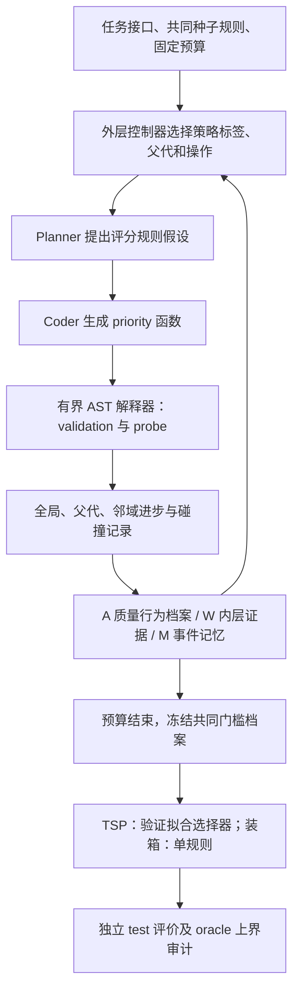
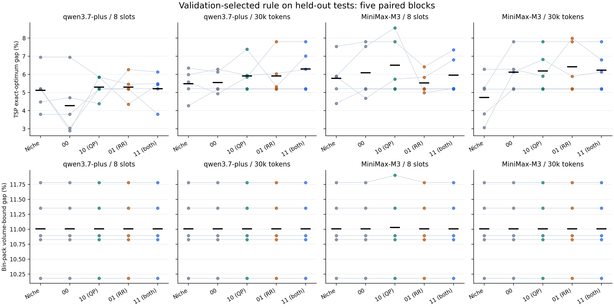
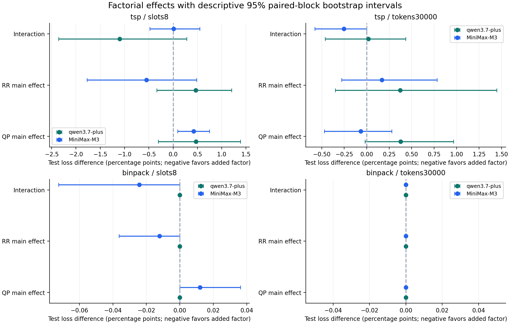
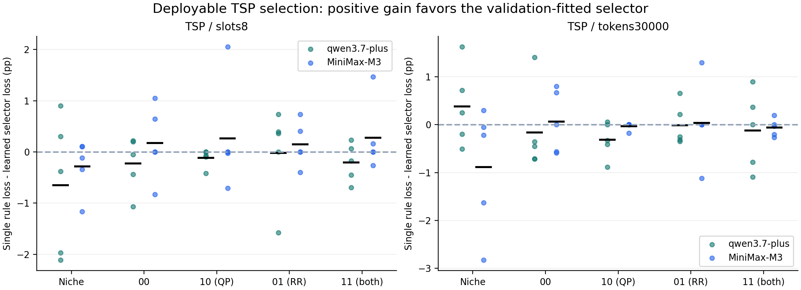

# 第六章 v1.1 技术报告：质量保护、重启修正与多算法用途

研究批次：`screening-20260923-r1`。实验源码：`7b4f9d2a8059fe1aadc92ddd09f1fde1bd9cb454`。本报告对应 200 次新模型搜索；此前 120 次追加验证只作历史动机，不并入本轮效果统计。

## 1. 结论与证据等级

200/200 次预定运行均已有结果，完整回放核验 200 次通过。本轮使用真实 Qwen3.7-Plus 和 MiniMax-M3 API，生成 1,448 个候选，其中 1,386 个有效。累计记录 2,893 次有 usage 的调用和 4,861,576 个输入加输出 tokens。

完整修订版 11 相对 niche 的测试损失均值在 0/8 个“模型×任务×预算”单元更低；配对 bootstrap 区间完全低于零的单元为 0/8，完全高于零的单元为 2/8。这里没有预注册通过门槛或多重比较校正，不能把区间不跨零称作确认性显著。五个区块的机制筛查只支持限定条件下的方向判断，不能单独确立稳定优势或博士创新。

目标问题确有真实依据：旧日志中 49 次未获信用的合格父代改进已重新计数，TSP 相同行为探针但验证质量改善的反例也已回放。本轮发现 94 次局部改善碰撞；其中 28 次在更新后仍位于搜索档案 A，2 次后来被用作父代。因而，识别进步、给调度信用、保留可开发的程序、兑现测试收益是四个需要分开检验的环节。

对旧 49 次事件还需纠正一项解释：其中 35 次已有规则的 probe 行为与验证逐实例损失完全相同；45 次在验证损失向量上被某个已有规则弱支配。它们优于父代，却不一定增加了已有解集的用途。固定验证支配仍不能证明目标分布上的永久无用或不存在后续潜力，但不能把 49 次都称为被错误放弃的有效新分支。

## 2. 本轮如何承接前五章

第三章的机制综述与联合空间 DWD 指标提供质量和分布同时评价的原则；第四章 MSLS-MA 提供结构多解、模式内开发和重启的动机，RMC-CMSA 提供按实际起点—过程—终端关系决定后续资源的直接来源；第五章 HDADE 提供质量空间与行为空间分别维护的依据。第六章将对象提升为能处理多个实例的程序规则，继承问题思想，重新验证相似性、轨迹和预算的含义。

本轮没有把 DWD 当作开放程序空间的真实模式召回；没有加入未经验证的高维投影；没有声称复现前章完整算法。外层轨迹是父程序→代码修改→子程序，内层轨迹是某程序构造路线或装箱的执行过程。W 仍保存内层证据，在四个关系控制器中保持相同，以便考察两个修正因素；它尚未获得独立贡献验证。

## 3. 实际系统架构

程序语言为数值评分函数，允许标量运算与条件分支，最多 320 AST 节点；模型提示同时要求不超过 25 行，但解释器实际硬约束为字符数/AST/操作数，不能把行数要求当作已验证的执行保证。TSP 从城市 0 开始逐步构造路线，各方法统一执行 24 次确定性 2-opt delta 检查；装箱只在当前可行箱中评分，不能读取未来物品。

TSP 行为距离为路线边集 Jaccard 距离在 probe 实例上的平均；装箱行为为前 24 个物品共箱关系的差异。阈值固定为 0.08，档案容量 10。它定义有限证据下的行为代表集，不是一般程序语义等价类或真实吸引域。

### 3.1 两个实验因素

对候选 p′ 分别记录 Δglobal = Lbest − L(p′)、Δparent = L(parent) − L(p′)、Δneighbor = L(neighbor) − L(p′)。父代/邻域进步必须大于 1e−4，候选还须处于当时最好验证损失 + 0.035 的范围；邻域只在 probe 距离≤0.08 时存在，最近邻平局按质量再按 ID 选择。

QP 开启后，合格局部进步可以获得开发信用，且相应碰撞不扣调度分。每个已分配标签最多两次局部信用，只有全局进步或合格的新行为增量才重置额度。RR 开启后，饱和统计只计没有全局/合格局部进步的碰撞；最近两次候选中的有效局部信用可暂时阻止 no-growth 重启。全局停滞、标签饱和与尚未尝试是不同触发条件；RR 没有取消“新标签→restart”。

重要实现边界：v1.1 仍按八类策略标签汇总信息，没有实现父模式×操作×意图×终端的完整条件转移模型；局部信用没有独立的父程序继续队列。修正改变了调度统计和提供给模型的 evidence 提示，因此实验估计的是整组修正的系统效果，不能独立归因于某个标量公式。

### 3.2 搜索门槛与读出门槛

内部 A 以当前最好验证质量为参照；最终读出统一改为最好共同手写种子的验证质量 + 0.035。独立 test 审计再用最好共同种子的 test 损失 + 0.035 过滤，并重新计数测试行为代表。test 门槛不进入搜索或选择器拟合。所有方法使用同一读出规则，避免某方法自身质量较差而获得更宽松的比较标准。

## 4. 冻结实验设计和版本

| 维度 | 冻结设置 |
|---|---|
| 模型 | alibaba-token-plan-cn/qwen3.7-plus；minimax-cn-coding-plan/MiniMax-M3 |
| 任务 | 12 城市 TSP；64 个物品的在线一维装箱 |
| 方法 | niche；00、10、01、11 四个关系控制器 |
| 资源 | 固定 8 proposal slots；30,000 输入+输出 token 上限且最多 32 slots |
| 区块 | 5 个独立实例区块，各方法、模型和预算使用相同区块；本地搜索 seed = block ID |
| 数据 | 每区块 3 个分布族；probe 9、validation 24、test 36；与旧实验种子不重叠 |
| 模型参数 | temperature = 0.7；planner/coder 输出上限分别 1800/2000 tokens |
| 总量 | 2×2×5×2×5 = 200 次预定搜索 |
| 并发 | 每提供方 1 条顺序队列；提供方之间并发 |

模型 API 未设置可控的随机种子；区块配对控制数据和控制器随机数，不能保证不同提示共享生成噪声。五个区块同时改变实例与生成随机性；同一区块候选和 36 个测试实例不能当作独立算法重复。各预算内比较使用相应完整搜索，不能拿固定槽数结果作事后 token 截断来替代预算实验。

初始准备提交 fb5bb6f 只有代码和干跑清单，未开展搜索。7b4f9d2 在搜索前修订了局部信用上限、TSP 选择器范围和恢复保护，并发布到公开 GitHub；真正的运行清单锁定该版本。后加的无 API 回放、机制审计、成本敏感性和图表工具与冻结核心分开版本化，不能回写核心或改变原始结果。

## 5. 完成状态、失败和成本

| 项目 | 实测 |
|---|---:|
| 预定 / 保存结果 | 200 / 200 |
| 已评价候选 / 有效 / 无效 | 1,448 / 1,386 / 62 |
| 有 usage 的模型调用 | 2,893 |
| 已记录输入+输出 tokens | 4,861,576 |
| 用量不完整运行 | 2 |
| 预留违规条数 | 0 |
| 已付 planner、未能准入 coder 的尝试 | 0 |
| 验证最优规则 test 执行失败 | 0 |
| 无 API 回放 validation / test 程序次数 | 2,048 / 1,003 |

无效候选按实际槽位计入，类型汇总为 `{'ProgramError': 59, 'ModelError': 2, 'ValueError': 1}`。错误请求可能被服务端计费但没有返回 usage，因此 4,861,576 tokens 是已记录成本总和，不能在有缺失用量时称为精确全成本。coding plan 的边际现金成本不从 token 数推定。基础设施排除详情见 `protocol_sensitivity.json`；主结果包含这些截断运行，成本完整配对另见 `sensitivity_complete_cost_pairs.csv`。

有完整 usage 的 token 上限运行平均实际使用 21,078.7 / 30,000 tokens。准入预留以 system/prompt UTF-8 字节数 + 512 余量 + 输出上限估算，通常保守，剩余预算不是零。相同上限并不等于相同实际消耗；本轮只能回答该准入实现下的预算鲁棒性，不能把差异全部归因于关系记忆质量。

## 6. 主实验逐单元结果

测试损失为百分比，TSP 相对于精确最优值，装箱相对于体积下界；后者不是相对于已知最优装箱数。每格为五个配对区块均值，完整区块值与区间在 `group_summary.csv`。生成数、成本、行为模式和质量需要联合阅读。

| 模型 | 任务 | 预算 | 方法 | test 损失 % | test 模式数 | 生成候选数 | 已记录 tokens |
|---|---|---|---|---:|---:|---:|---:|
| MiniMax-M3 | binpack | slots8 | niche | 11.007 | 5.20 | 8.00 | 24,164 |
| MiniMax-M3 | binpack | slots8 | 00：原关系规则 | 11.007 | 4.40 | 8.00 | 31,131 |
| MiniMax-M3 | binpack | slots8 | 10：质量保护 | 11.032 | 3.80 | 8.00 | 31,769 |
| MiniMax-M3 | binpack | slots8 | 01：重启修正 | 11.007 | 3.40 | 8.00 | 31,613 |
| MiniMax-M3 | binpack | slots8 | 11：完整修订 | 11.007 | 3.80 | 8.00 | 31,406 |
| MiniMax-M3 | binpack | tokens30000 | niche | 11.007 | 2.60 | 8.00 | 22,741 |
| MiniMax-M3 | binpack | tokens30000 | 00：原关系规则 | 11.007 | 3.20 | 5.40 | 19,505 |
| MiniMax-M3 | binpack | tokens30000 | 10：质量保护 | 11.007 | 2.60 | 5.40 | 20,199 |
| MiniMax-M3 | binpack | tokens30000 | 01：重启修正 | 11.007 | 2.60 | 5.60 | 20,333 |
| MiniMax-M3 | binpack | tokens30000 | 11：完整修订 | 11.007 | 3.40 | 5.60 | 19,967 |
| MiniMax-M3 | tsp | slots8 | niche | 5.780 | 3.40 | 8.00 | 22,312 |
| MiniMax-M3 | tsp | slots8 | 00：原关系规则 | 6.081 | 3.40 | 8.00 | 30,175 |
| MiniMax-M3 | tsp | slots8 | 10：质量保护 | 6.497 | 2.80 | 8.00 | 30,486 |
| MiniMax-M3 | tsp | slots8 | 01：重启修正 | 5.525 | 2.80 | 8.00 | 29,987 |
| MiniMax-M3 | tsp | slots8 | 11：完整修订 | 5.952 | 2.20 | 8.00 | 32,376 |
| MiniMax-M3 | tsp | tokens30000 | niche | 4.717 | 4.00 | 8.00 | 22,556 |
| MiniMax-M3 | tsp | tokens30000 | 00：原关系规则 | 6.119 | 2.00 | 5.80 | 21,824 |
| MiniMax-M3 | tsp | tokens30000 | 10：质量保护 | 6.181 | 2.20 | 5.60 | 20,323 |
| MiniMax-M3 | tsp | tokens30000 | 01：重启修正 | 6.414 | 1.80 | 5.60 | 20,276 |
| MiniMax-M3 | tsp | tokens30000 | 11：完整修订 | 6.223 | 2.40 | 5.40 | 20,522 |
| qwen3.7-plus | binpack | slots8 | niche | 11.007 | 2.60 | 8.00 | 16,417 |
| qwen3.7-plus | binpack | slots8 | 00：原关系规则 | 11.007 | 2.40 | 8.00 | 27,610 |
| qwen3.7-plus | binpack | slots8 | 10：质量保护 | 11.007 | 2.40 | 8.00 | 27,865 |
| qwen3.7-plus | binpack | slots8 | 01：重启修正 | 11.007 | 2.80 | 8.00 | 27,706 |
| qwen3.7-plus | binpack | slots8 | 11：完整修订 | 11.007 | 2.60 | 8.00 | 28,025 |
| qwen3.7-plus | binpack | tokens30000 | niche | 11.007 | 3.80 | 9.80 | 20,848 |
| qwen3.7-plus | binpack | tokens30000 | 00：原关系规则 | 11.007 | 3.00 | 6.20 | 20,797 |
| qwen3.7-plus | binpack | tokens30000 | 10：质量保护 | 11.007 | 2.00 | 6.00 | 19,946 |
| qwen3.7-plus | binpack | tokens30000 | 01：重启修正 | 11.007 | 2.40 | 6.00 | 20,101 |
| qwen3.7-plus | binpack | tokens30000 | 11：完整修订 | 11.007 | 2.00 | 6.00 | 20,064 |
| qwen3.7-plus | tsp | slots8 | niche | 5.122 | 4.80 | 8.00 | 19,794 |
| qwen3.7-plus | tsp | slots8 | 00：原关系规则 | 4.274 | 4.00 | 8.00 | 27,483 |
| qwen3.7-plus | tsp | slots8 | 10：质量保护 | 5.293 | 3.40 | 8.00 | 27,543 |
| qwen3.7-plus | tsp | slots8 | 01：重启修正 | 5.291 | 3.40 | 8.00 | 27,502 |
| qwen3.7-plus | tsp | slots8 | 11：完整修订 | 5.209 | 3.60 | 8.00 | 27,600 |
| qwen3.7-plus | tsp | tokens30000 | niche | 5.475 | 4.20 | 10.00 | 24,954 |
| qwen3.7-plus | tsp | tokens30000 | 00：原关系规则 | 5.546 | 3.00 | 6.40 | 21,169 |
| qwen3.7-plus | tsp | tokens30000 | 10：质量保护 | 5.913 | 3.40 | 6.20 | 21,110 |
| qwen3.7-plus | tsp | tokens30000 | 01：重启修正 | 5.908 | 4.60 | 6.40 | 20,777 |
| qwen3.7-plus | tsp | tokens30000 | 11：完整修订 | 6.295 | 2.80 | 6.20 | 21,338 |

### 6.1 完整修订版 11 与 niche 的配对差

损失差 = 11 − niche，负值有利于 11；单位为百分点。模式差为 11 − niche，正值有利于 11。方括号是五区块配对 bootstrap 的描述性 95% 区间，不是校正后的确认性结论。

| 模型 | 任务 | 预算 | test 损失差 pp [95% 区间] | test 模式差 [95% 区间] |
|---|---|---|---:|---:|
| MiniMax-M3 | binpack | slots8 | 0.000 [0.000, 0.000] | -1.400 [-3.400, 1.200] |
| MiniMax-M3 | binpack | tokens30000 | 0.000 [0.000, 0.000] | 0.800 [-0.200, 2.000] |
| MiniMax-M3 | tsp | slots8 | 0.171 [-0.348, 0.691] | -1.200 [-2.800, 0.200] |
| MiniMax-M3 | tsp | tokens30000 | 1.506 [0.485, 2.527] | -1.600 [-3.600, 0.400] |
| qwen3.7-plus | binpack | slots8 | 0.000 [0.000, 0.000] | 0.000 [-1.200, 1.000] |
| qwen3.7-plus | binpack | tokens30000 | 0.000 [0.000, 0.000] | -1.800 [-3.200, -0.600] |
| qwen3.7-plus | tsp | slots8 | 0.088 [-0.826, 0.990] | -1.200 [-2.200, -0.200] |
| qwen3.7-plus | tsp | tokens30000 | 0.820 [0.243, 1.575] | -1.400 [-2.800, 0.000] |

### 6.2 两因素主效应和交互

QP 主效应 = [(10−00)+(11−01)]/2；RR 主效应 = [(01−00)+(11−10)]/2；交互 = 11−10−01+00。先在每个区块内构造对比，再重采样整个区块。不能把生成候选当重复样本增加显著性。

| 模型 | 任务 | 预算 | QP 效应 pp [95% 区间] | RR 效应 pp [95% 区间] | 交互 pp [95% 区间] |
|---|---|---|---:|---:|---:|
| MiniMax-M3 | binpack | slots8 | 0.012 [0.000, 0.036] | -0.012 [-0.036, 0.000] | -0.024 [-0.072, 0.000] |
| MiniMax-M3 | binpack | tokens30000 | 0.000 [0.000, 0.000] | 0.000 [0.000, 0.000] | 0.000 [0.000, 0.000] |
| MiniMax-M3 | tsp | slots8 | 0.422 [0.094, 0.749] | -0.551 [-1.771, 0.485] | 0.011 [-0.478, 0.547] |
| MiniMax-M3 | tsp | tokens30000 | -0.064 [-0.472, 0.279] | 0.168 [-0.279, 0.783] | -0.252 [-0.576, 0.000] |
| qwen3.7-plus | binpack | slots8 | 0.000 [0.000, 0.000] | 0.000 [0.000, 0.000] | 0.000 [0.000, 0.000] |
| qwen3.7-plus | binpack | tokens30000 | 0.000 [0.000, 0.000] | 0.000 [0.000, 0.000] | 0.000 [0.000, 0.000] |
| qwen3.7-plus | tsp | slots8 | 0.469 [-0.307, 1.384] | 0.467 [-0.337, 1.201] | -1.101 [-2.359, 0.279] |
| qwen3.7-plus | tsp | tokens30000 | 0.377 [-0.018, 0.967] | 0.372 [-0.348, 1.446] | 0.019 [-0.461, 0.433] |

## 7. 多算法集合是否有实际用途

TSP 用验证集的逐实例损失拟合标准化 Ridge 多输出预测器（alpha=10），输入只有城市几何特征；预测最低损失规则后才读取对应测试损失。每实例只需选择一个规则，不用测试标签寻找正确算法。装箱不开展这一实验，避免完整序列特征泄露未来输入。

20 个 TSP“模型×预算×方法”单元中，学习选择器的均值收益为正的单元为 7/20。这个计数只是描述；需要结合每格五个区块和区间判断一致性。所有具备选择器结果的 TSP 运行中，选择特征与预测时间均值为 2.130 ms/实例。该时间是本机运行测量，不等同硬实时保证或跨机器效率排名。

另对 100 次 TSP 运行回放冻结选择和单一规则：选择器特征/预测时间加被选算法执行时间的平均开销为 8.963 ms/实例，单规则为 6.682 ms/实例；逐运行时间比均值为 1.349。逐实例选择损失回放一致。精确参考最优值预先计算，不计入部署时间；特征/预测时间来自原始 36 实例批处理平均，规则执行时间来自之后一次本机回放，两者相加为描述性成本估计，不等同同时测得的端到端时延保证。详见 `deployment_cost.csv`。

| 模型 | 预算 | 方法 | 单规则损失 % | 学习选择器损失 % | 选择收益 pp [95% 区间] | oracle 潜力 pp（不可部署） |
|---|---|---|---:|---:|---:|---:|
| MiniMax-M3 | slots8 | niche | 5.780 | 6.062 | -0.282 [-0.746, 0.061] | 2.336 |
| MiniMax-M3 | slots8 | 00：原关系规则 | 6.081 | 5.908 | 0.173 [-0.368, 0.725] | 2.008 |
| MiniMax-M3 | slots8 | 10：质量保护 | 6.497 | 6.235 | 0.262 [-0.427, 1.225] | 2.112 |
| MiniMax-M3 | slots8 | 01：重启修正 | 5.525 | 5.376 | 0.149 [-0.159, 0.509] | 1.313 |
| MiniMax-M3 | slots8 | 11：完整修订 | 5.952 | 5.678 | 0.273 [-0.126, 0.881] | 1.453 |
| MiniMax-M3 | tokens30000 | niche | 4.717 | 5.603 | -0.886 [-2.032, 0.055] | 1.452 |
| MiniMax-M3 | tokens30000 | 00：原关系规则 | 6.119 | 6.055 | 0.065 [-0.459, 0.589] | 1.778 |
| MiniMax-M3 | tokens30000 | 10：质量保护 | 6.181 | 6.216 | -0.035 [-0.105, 0.000] | 1.101 |
| MiniMax-M3 | tokens30000 | 01：重启修正 | 6.414 | 6.379 | 0.035 [-0.672, 0.777] | 1.361 |
| MiniMax-M3 | tokens30000 | 11：完整修订 | 6.223 | 6.286 | -0.063 [-0.201, 0.075] | 1.566 |
| qwen3.7-plus | slots8 | niche | 5.122 | 5.775 | -0.653 [-1.710, 0.404] | 2.444 |
| qwen3.7-plus | slots8 | 00：原关系规则 | 4.274 | 4.501 | -0.227 [-0.688, 0.158] | 1.986 |
| qwen3.7-plus | slots8 | 10：质量保护 | 5.293 | 5.412 | -0.119 [-0.273, -0.015] | 1.851 |
| qwen3.7-plus | slots8 | 01：重启修正 | 5.291 | 5.308 | -0.017 [-0.800, 0.523] | 2.304 |
| qwen3.7-plus | slots8 | 11：完整修订 | 5.209 | 5.415 | -0.206 [-0.494, 0.083] | 1.894 |
| qwen3.7-plus | tokens30000 | niche | 5.475 | 5.098 | 0.377 [-0.232, 1.078] | 2.793 |
| qwen3.7-plus | tokens30000 | 00：原关系规则 | 5.546 | 5.713 | -0.167 [-0.660, 0.627] | 1.902 |
| qwen3.7-plus | tokens30000 | 10：质量保护 | 5.913 | 6.225 | -0.312 [-0.612, -0.042] | 2.599 |
| qwen3.7-plus | tokens30000 | 01：重启修正 | 5.908 | 5.919 | -0.011 [-0.317, 0.371] | 3.173 |
| qwen3.7-plus | tokens30000 | 11：完整修订 | 6.295 | 6.417 | -0.122 [-0.748, 0.504] | 2.475 |

oracle 按每个测试实例事后取最好规则，因此使用了部署时不可得的答案，只表示集合潜力。可部署选择器和 oracle 之间的差距说明“发现互补算法”与“以低成本正确选择算法”是不同研究问题。

## 8. 机制诊断与当前缺陷

新搜索中累计 954 次 restart，触发“尚未尝试标签”785 次、“连续无收益”559 次、“饱和”0 次；原因可以重叠，不相加为互斥分解。目标 local-only 碰撞 94 次、信用资格 94 次、额度耗尽 0 次。详见 `MECHANISM_AUDIT.md`。

本轮 local-only 事件中，55 次与某已有程序的 probe 行为及验证逐实例损失完全相同，64 次被某已有验证损失向量弱支配。这些事件不自动代表应继续保护的模式内潜力，也不能仅因计入 useful_gain 就认为产生了用途增量。

固定历史回放按相同已保存程序分别模拟 00/10/01/11，报告下一步父代、标签和操作是否变化；这种诊断没有重新生成模型输出，不是反事实性能实验。日志能够揭示机制是否触发和信息是否进入决策，无法证明改变提示后的最终收益。

| 缺陷 | 本轮能检验的内容 | 尚未解决的部分 |
|---|---|---|
| 局部信用与父程序生存分离 | 局部进步是否得信用、是否入 A、以后是否被使用 | 未建立小容量、有限期限的分支继续队列；模式内潜力可能仍被代表去重掩盖 |
| 八标签调度粒度过粗 | untried、stalled、saturation 的触发频数 | 未估计真实父分支×操作的收益；短搜索中标签轮转可能先消耗预算 |
| 关系上下文昂贵 | 同候选槽位与 token 上限分别比较，保留实际 token | 没有紧凑关系充分统计、tokenizer 原生计数或净收益/成本调度 |
| 质量—行为关系仍有限 | 固定探针相似与质量进展并行记录 | 没有按需 witness；不能断言已辨认真实算法模式 |
| 选择器与算法互补性分离 | TSP 验证拟合选择器及 oracle 潜力 | 固定小样本 Ridge 不是强选择器，不足以验证分布移位的实用性 |
| 语言与任务小 | 12 城市 TSP/64 物品在线装箱的闭环可审计 | 无大规模任务、任意代码、学习管线、运行时竞争或外部作者版对照 |
| API 不确定性 | 原始请求失败、完整成本和缺失成本分层 | 无 usage 的失败成本不可恢复，不应宣称精确预算保证 |
| 机制主效应不能等同创新 | 两因素整组作用与结构性缺口 | MLEvolve/SeaEvo/AdaEvolve/FunSearch/GEPA 的相同信息强基线尚未复现 |

## 9. 下一阶段技术路线和实验设计

以下是本轮诊断形成的后续设计，不是本轮已经实现或验证的结果。建议先处理父程序继续开发的执行链，再加入复杂关系图或 witness。

1. 定义外层分支为起始程序及其改进链。把输出档案 A 与可开发分支池 B 分开：A 维持质量/行为代表；B 只给质量合格、有实质父代增益且尚未被已有观测完全解释的子程序有限继续机会。比较父代进步、已有代表进步与真实互补性；对于重新找到已知规则的情形，不把它当作新用途收益。过期依据尝试次数和累计成本，不能靠重复比较较差父代无限续期。
2. 将 RMC-CMSA 的关系记忆迁移到父分支→修改操作→子程序的外层，而不是把内层路径前缀当作全部关系。先用少量操作类别和质量/行为状态的共享统计，样本不足时回退，避免稀疏四维关系表。
3. 冻结短提示与当前长提示的对照，以及等上下文长度的记忆打乱对照；调度成本分别记录 planner、coder、失败、评估和辨识。独立比较策略质量、上下文长度和预算准入。
4. 先在可控程序邻域的机制集测试：相似且真进步、相似且无进步、父代进步但仍差于全局最好、新行为但低质量。输出继续概率、有效父代留存、开发深度、预算成本和最终持出质量；程序邻域的真值只用于诊断，不进入模型提示。
5. 再做 live 2×2：分支继续池开/关 × 紧凑成本调度开/关，另加 niche、当前 11、同信息质量调度对照。至少固定候选槽位和真实 token 上限两种预算；开发与确认使用新的不重叠种子和更长搜索，实例族和模型响应重复分层。
6. 在开发方差上预先规定最小有意义收益和功效目标，锁定一个主比较后确定确认区块数量，避免用五区块区间直接给出最终样本数。确认应至少覆盖 TSP 更大规模/新分布、一个异质算法发现任务和第二模型；不得把同一任务反复划分当作大量独立任务。
7. 只有模式误判实际影响保留、替换或重启时才增补 witness；对照同执行成本扩大固定 probe，未影响决策的关系允许保持未决。需要在搜索收益上验证，不能只凭分类误判率下降宣布有效。
8. 多算法用途将验证集选择的单规则、冻结实例选择器、oracle 上界分开。确认阶段计入选择器特征/预测、算法执行时间和内存；对在线任务另行设计只读已到达前缀的选择协议。

推荐章节题目仍可收窄为《面向自动算法发现的质量保护与执行关系驱动多模态搜索方法》。章节应围绕“前章迁移与问题定义—v1 失效—v1.1 机制筛查—分支开发与紧凑关系方法—多算法用途—独立确认和失效条件”组织。当前可写成方法探索及证据链，最终新方法贡献须由后续相同信息强对照和独立实验支持。

## 10. 文件索引、复现与公开版本管理

- `manifest.json`：200 个工作单元、模型、数据种子/指纹、源码版本和依赖版本。
- `run_level.csv`、`group_summary.csv`、`paired_contrasts.csv`：逐运行数据、均值/中位数/区间和因子对比。
- `verification.json`：全部节点验证评价、全部 test 程序、控制器决策、档案与 usage 的回放。
- `MECHANISM_AUDIT.md`、`mechanism_audit.json`：局部进步暴露、后续使用及固定历史决策诊断。
- `protocol_sensitivity.json`：成本和失败敏感性；原始异常从未按结果好坏删除。
- `historical_motivation.json`：旧 49 次父代进步与 TSP 反例的独立复核。
- `qwen-raw-runs.zip`、`minimax-raw-runs.zip`：所有新运行的提示、响应、候选、checkpoint、结果、usage 和控制台记录。
- `preregistered-source.zip`：冻结源码；`EVIDENCE_MANIFEST.json` 和 `SHA256SUMS.txt`：归档及逐原始文件哈希。

公开发布采用实验分支、预注册标签、结果提交与 screening 结果标签分离；旧 d7fd074 资料保留。读取结果不需要 API 密钥。重新搜索依赖接收电脑自己的 OpenCode 模型凭据；确定性回放不调用模型。请把两个 raw ZIP 解压到同一数据目录，并把 `preregistered-source.zip` 解压到独立源码目录。源码指纹包含冻结文档，因此必须从该源码快照导入评估器：从仓库根目录将 `PYTHONPATH` 指向冻结源码目录，再运行 `python experiments/chapter6/v11/verify_screening.py <数据目录>`。统计和图表也可由相应模块重新生成。

实验清单哈希：`2ca14d7e95de1173773bcd5e8c1f76d52cfd1d29314507cdb5f4ff67364bd19a`。源码指纹：`3ff293fa5fe8eac7a2982fe029090ebdf211e6565eabd2159bdb02ac25741bc3`。
