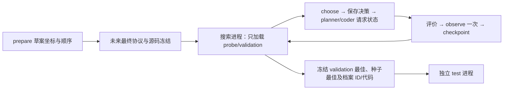

# v1.2.2：启动准备与离线集成验证

从独立复核提交 `2a870dd` 开发。此版本实现阶段 A；**没有发起新模型调用，没有执行 16 次模型搜索，也没有冻结新的效果实验**。两臂继续使用原 `V121SearchState`，控制器选择规则未改变。

入口是 `python -m chapter6_demo.v12_2.cli`；旧 `discovery.py` / `v12.run_v12` 仍只负责旧实验。本版本不能用旧启动器替代。最新结果见 [readiness-20260925](results/readiness-20260925/REPORT_ZH.md)。

## 运行结构

1. `prepare --dry-run`：按复核建议顺序保存 16 项草案及区块 3–6 坐标。每块单独保存 search（probe/validation）和 test 文件；检查与旧 324 个实例及各 split 间的 ID/精确坐标重复。此过程封禁网络/模型客户端。
2. `freeze`：未来接受并提交最终协议后，复制草案的坐标原始字节，绑定最终协议、源码文件指纹和环境，生成单独的待执行 manifest。不会发送模型请求。当前仓库只有草案，没有可执行冻结 manifest。
3. `search --live --job ...`：只能接受已冻结协议，明确实例化 `V121SearchState`；一次运行一个任务，不开启常驻后台服务。同 provider 的先后顺序受 manifest 与 lane lock 限制。
4. `test_stage --job ...`：单独进程加载已完成并冻结的 validation 输出，之后才打开 test 坐标。种子基线同样按 validation 选择，不按 test 选优。不训练 selector。



## 当前可执行的离线命令

仓库根目录，CPython 3.12.14 或 3.13.5；依赖记录在 `requirements.lock.txt`。选择新输出目录，已发布证据不会被覆盖。

```powershell
python -m pytest experiments/chapter6/v12_2 experiments/chapter6/v12_1 experiments/chapter6/v12/test_v12.py experiments/chapter6/v11/test_v11.py -q
python -m chapter6_demo.v12_2.cli prepare --dry-run --output experiments/chapter6/v12_2/local-draft
python -m chapter6_demo.v12_2.smoke --output experiments/chapter6/v12_2/local-fixtures
python -m chapter6_demo.v12_2.replay_r2 --output experiments/chapter6/v12_2/local-r2-replay
python -m chapter6_demo.v12_2.verify_identity --output experiments/chapter6/v12_2/local-identity.json
python -m chapter6_demo.v12_2.archives experiments/chapter6/v12/results/screening-20260924-r2
```

`smoke` 使用写死的假响应和旧 r2 block 0 坐标，完成两个控制器的 planner→coder→真实受限评价→checkpoint→独立 test 全链路。它的 gap 只是测试夹具输出，不能用于两臂效果比较。真实两模型×两控制器×四新区块仍是未执行的设计。

## 中断与恢复

每个槽位的 `decision.json` 与 `request.json` 不可变；`sent_unknown` 在发请求前持久化，完整响应先落盘再解析。请求状态不明时停止该运行，不重试、不补位，也不把它当作有确定评价的无效候选。调用失败或 usage 缺失时总 tokens 为 null，另报可核实的已知 tokens。

恢复重新执行每一步 `choose`，核对目标/操作/父代/参考及完整 allocation 后再 `observe`；验证 B、M、成功谱系、历史、RNG 和 pending 状态。已完成时隙不重复扣款；Planner 响应落盘后只继续 Coder，Coder 响应落盘后只继续本地解析与评价。已保存 candidate 的评价也直接复用。单运行 OS lock 防止两个进程同时发送同一请求。

准入条件仍是“入池时竞争性”；不增加动态质量再筛选。诊断记录选择时相对最好质量的差、多条目数、不同标签数、族分数是否不同、组合排序与 gain-only 是否改变父代。标签是请求的修改族，不是程序语义真值。

## 程序身份与归档

新输出保存代码 UTF-8 原始 SHA-256、`chapter6-priority-ast-json-v1` 全长结构 SHA-256 和旧运行时 AST 哈希。结构格式使用显式节点/字段列表、无位置属性、标量类型及浮点 hex；不依赖 `ast.dump` 默认展示。它只覆盖已验证的受限语言；新 Python 增添未知字段时拒绝悄悄解释。

旧 r2 复核分开保存 `numeric_strict.json` 与 `numeric_compatibility.json`：严格字段/连续值结果不改写，旧 AST 字符串差异另外用有名称的 CPython 3.13 子集格式核查。只有哈希格式差异能得到这种解释；路线、决策、缺字段或越界数值差异仍失败。原 PR 中的 Linux `passed=false` 文件不修改。

ZIP 读取规范化两种分隔符并拒绝重名；读取原始 member 字节，不重打包历史 ZIP。清单通过 `git ls-files` 的发布路径生成，缓存和未跟踪临时文件不进入包。先 stage 发布文件，再运行 `archives <包路径> --write`，随后将清单一并提交。

## 限制与下一阶段

这次验证不回答组合排序是否更好，也不证明族信息、多个程序集合或博士章节的有效创新。真实接口只实现了既有 OpenCode 的 OpenAI/Anthropic 请求格式，未做新服务连通性探测。模型服务实际响应版本在首次调用时记录；服务没有返回版本时保持未知。

未来 16 次筛查仍需最终协议与独立源码冻结，明确实际意义阈值、可接受 token 增量及提供方版本可用性。H1 比较组合排序/FIFO；H2 另加 gain-only/证据打乱；H3 另用独立训练并冻结的选择器。旧 r2、固定候选流探测与本版工程夹具不能并为模型实验重复样本。

测试隔离是受限评分语言与受控入口的数据流隔离，不是防御可任意访问本机文件的恶意进程。断电可能在服务响应到达与本地写入之间造成不确定状态，这种情况只保留停止记录。
