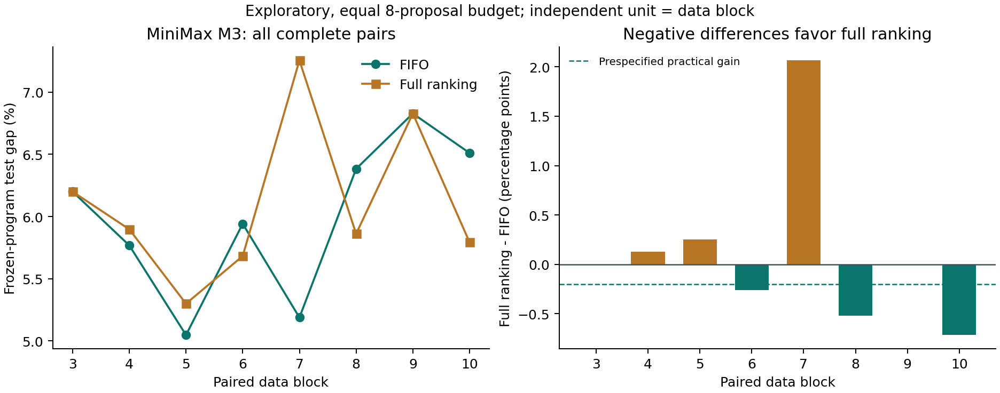
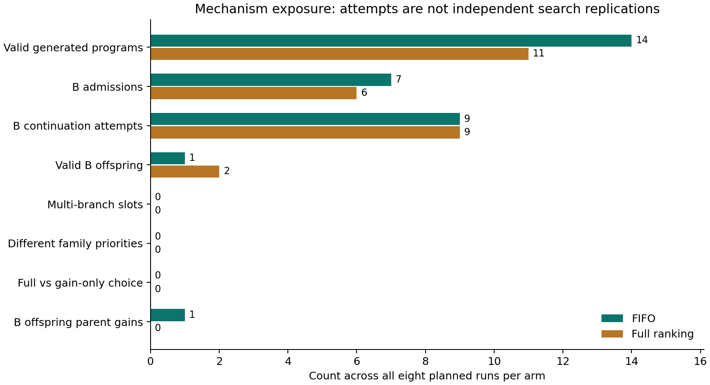

# 第六章 v1.2.3：MiniMax M3 真实筛查技术报告

日期：2026-09-26。批次：v123-minimax-paired-screening-20260926-r1。分支：experiment/v1.2.3-minimax-screening。

**已完成 16 次真实搜索、16 次独立测试读出、128 个候选时隙和完整归档。本轮未建立完整排序优于 FIFO 的证据；更重要的是，排序因素在这些真实轨迹上没有产生任何决策差异。** 主要问题是当前 MiniMax M3 的输出预算与任务响应不匹配，103/128 个提案在解析阶段失败，开发池没有形成多分支竞争。因此，应先解决生成输出与机制可观测性，再启动下一份冻结协议，不能把本轮差值解释为族信息有效或无效的因果估计。

## 1. 本轮范围与版本

用户指定本机 OpenCode 的 MiniMax coding plan / MiniMax M3。原未执行的“双模型 × 两组 × 四块”草案保留不动；本轮在调用前明确修订为 **MiniMax M3 × 两组 × 八个配对数据区块＝16 次**。它不提供跨模型证据，也不包含无 B、仅收益、打乱族证据或选择器的新搜索。

| 记录 | 版本及用途 |
|---|---|
| 搜索算法和运行器 | 44bafd2344d6a25e247c93c62280e6bf20e5e508；V121SearchState + v1.2.2 runner |
| 原独立评审 | fbb7a7a6077158c89e34b8be06bfcc7c31680407；后续以合并提交 c018aa6 保留历史 |
| 协议与调度源码 | 15caaa5；先于任何新搜索提交 |
| 已归档坐标与任务草案 | 628f0ad6f469269d5d6d7f7b69a9ea476cab4080 |
| 冻结清单发布 | b24b5dafe3a0ca5438fe4a0f236356431bf4f467 |
| 冻结标签 | chapter6-v1.2.3-minimax-protocol-20260926-r1 |
| manifest 的规范 SHA256 | 9a623fec5a481ad4645ae014887a4b4f820bf61b2e89d234bd75c35ad5af22b8 |
| 离线分析与演示工具初次发布 | e75084f；不被搜索运行器导入 |

源码、坐标、manifest 和协议先推送，再执行真实模型调用。运行期间没有修改冻结源码、输出预算、提示、评分、候选数或故障规则。原 v1、v1.1、r2、离线版本、旧标签及原始 ZIP 都保留。

## 2. 架构与公平对照

详细接口见 [V123_ARCHITECTURE.md](../../../../../docs/chapter6/V123_ARCHITECTURE.md)。A 保存输出行为代表；B 保存最多 3 个程序的有限开发额度，每条 2 次；M 保存已执行候选反馈。W 不参与决策。两组共享 niche 普通调度、同样的准入和淘汰、奇数步开发、提示序列化与程序评价。

F 选择仍有额度的最老 B 条目并耗尽其机会，使用严格 FIFO。R 在同样条目上最大化

$$s(b)=q(\mathrm{tag}_b)+0.25\frac{\mathrm{gain}_b}{1+\mathrm{attempts}_b}.$$

q 是平滑的标签层面合格改进频率；少于 2 条标签观察时回退到共享频率，不是校准后的未来成功概率。分配标签代表要求尝试的方向，不当作程序语义真值。

候选若与旧程序的 probe 行为及 validation 逐实例损失完全相同，先归类为已知规则重现。其余相对父代实质进步且准入时质量合格的候选可获得 B 额度。行为接近不能单独排除进步，但获得信用也不意味着无限续命。成功改进深度与尝试深度分别记录。

本轮没有改大架构、添加关系图或 witness；重点是让已经修复的 F/R 公平对照真正运行。A/B/M 的概念来自既有版本，不能把运行工具或规范化归档本身作为新的方法创新。

## 3. 冻结实验设计

| 项目 | 本轮配置 |
|---|---|
| 任务 | TSP，14 城市；uniform / clustered / grid 三实例族 |
| 独立重复 | 数据块 3–10，共 8 个；每块 F/R 成对 |
| 每块数据 | 12 probe、36 validation、60 test；坐标预先归档 |
| 总实例 | 864 个唯一新实例；不把实例当作 864 次搜索重复 |
| 块来源 | 3–6 从 v1.2.2 草案逐字节复制；7–10 同生成器 |
| 共同初始化 | nearest_neighbor、return_aware、regret_aware 三规则 |
| 每次搜索 | 8 个候选时隙；总计 128，无自动补位 |
| 程序执行 | 固定受限 priority(f)，每次路线统一 24 次确定性 2-opt 检查 |
| 模型 | minimax-cn-coding-plan / MiniMax-M3，api.minimaxi.com/v1 |
| 请求参数 | temperature 0.7；planner 输出上限 1800；coder 2000；timeout 120 秒 |
| 预算口径 | 相同提案数；没有总 token 上限，不能称相同 token 预算 |
| 顺序 | order seed 9241201 全体打乱后顺序运行 |
| 失败 | 解析失败占时隙；开发时仍扣额度；未知请求不自动重发；两次连续基础设施失败时停止 |
| 主差值 | Δ=100×(R test gap−F test gap)，单位百分点，负值有利 R |
| 区间 | 8 个完整区块配对 bootstrap，20,000 次，seed 9261203，95% percentile 描述性区间 |
| 筛查阈值 | 实用收益 0.2 个百分点；平均 token 增幅至多 25%；不是确认性显著性门槛 |

所有返回 model 字段均为 MiniMax-M3。服务端不可变快照未知，不能把目录别名视作固定权重版本。原始请求、返回模型、request ID、响应时间、usage 和完整内容都保留。没有搜索级 API seed；重复运行不能保证重新生成相同程序。

本机环境为 Windows 11、CPython 3.13.5、numpy 2.1.3、scikit-learn 1.6.1、matplotlib 3.10.0、pytest 8.3.4。数据文件相同不等于任意平台浮点位级结果已验证；本轮数值复核是在本机完成。

## 4. 执行完整性与实测成本

16/16 搜索完成，16/16 有独立 test 读出，8/8 完整配对；没有基础设施不完整、替换运行或未启动任务。上海时间约 02:50–03:20 完成模型搜索。最后搜索结束 UTC 19:20:19.608906，首次独立 test 评价 UTC 19:21:23.387367；全部 test 晚于所有搜索。

每个运行先按 validation 选择输出程序、初始最佳规则与报告档案，再由独立进程加载 test。冻结文件的状态字符串 search_complete_test_not_run 保持原样；tests/ 文件与 analysis/runs.csv 中 independent_test_completed=True 记录实际已完成测试，没有为更新进度改写原搜索结果。

| 项目 | FIFO F | 完整排序 R | 合计 |
|---|---:|---:|---:|
| 搜索运行 | 8 | 8 | 16 |
| 提案时隙 | 64 | 64 | 128 |
| API 请求 | 79 | 77 | 156 |
| 已报告 token | 213,036 | 209,121 | 422,157 |
| 平均 token / 运行 | 26,629.5 | 26,140.125 | — |
| 平均搜索秒数 | 118.151 | 101.997 | — |
| 有效生成程序 | 14 | 11 | 25 |
| 解析失败提案 | 50 | 53 | 103 |
| 解析后程序执行失败 | 0 | 0 | 0 |
| 无有效新程序的运行 | 3 | 2 | 5 |

156 次包括 128 次 planner 与 28 次 coder；输入 token 为 172,671，输出 249,486。R 平均已报告 token 比 F 少 1.84%；这只是实际使用量，不证明更高搜索效率。累计 API 等待约 1,665.82 秒；搜索墙钟与串行总时长还含评价和进程开销。

另有 **1 次独立连通性 preflight**：186 输入 + 41 输出＝227 tokens，1.268 秒，只请求 ready=true，没有任务实例，不计为一次搜索。全轮模型请求合计 157 次、已报告 token 422,384。coding plan 的账单金额未核验，不以 token 统计伪造人民币成本。

## 5. 质量结果：没有稳定优势

平均 Test gap：F **5.983278%**，R **6.101881%**。平均 Δ=**+0.118603 个百分点**，中位数 0；3 块有利 R、2 块相同、3 块有利 F。描述性 95% 区间为 **[−0.341638，+0.749061] 个百分点**。这不是确认性区间，也不据此宣布等效、非劣或显著差异。

| 区块 | F Test gap | R Test gap | Δ，百分点 | F tokens | R tokens |
|---|---:|---:|---:|---:|---:|
| 3 | 6.199573% | 6.199573% | 0.000000 | 27,466 | 26,792 |
| 4 | 5.767705% | 5.897170% | +0.129465 | 30,294 | 26,514 |
| 5 | 5.047967% | 5.299686% | +0.251718 | 28,460 | 23,199 |
| 6 | 5.941781% | 5.682547% | −0.259235 | 25,292 | 24,948 |
| 7 | 5.188510% | 7.254179% | +2.065668 | 27,062 | 28,596 |
| 8 | 6.383083% | 5.860891% | −0.522192 | 23,286 | 28,489 |
| 9 | 6.827474% | 6.827474% | 0.000000 | 28,367 | 22,887 |
| 10 | 6.510129% | 5.793526% | −0.716603 | 22,809 | 27,696 |

共同“validation 选出的初始单规则”平均 Test gap 为 **6.228340%**，F 相对它平均改善 0.245062 个百分点、R 改善 0.126459 个百分点。但两组都有 B，也都允许普通搜索，因此这不能证明 B 比无 B 有用。F 中 6/8、R 中 3/8 最终仍选择初始规则。R 在块 4、7 的 validation 选择在 test 上不优于初始规则，显示有限验证的泛化限制。

完整逐运行表见 [runs.csv](analysis/runs.csv)，配对表见 [pairs.csv](analysis/pairs.csv)。块 7 的较大差异保留在分析中，不以“异常点”为由删除。8 个区块的结果不外推为跨模型或跨任务优势。

## 6. 机制结果：执行链存在，排序因素没有生效机会

| 机制指标 | F | R |
|---|---:|---:|
| 至少有一次候选入 B 的运行 | 4/8 | 6/8 |
| 准入 B 的候选 | 7 | 6 |
| 实际分支续开发尝试 | 9 | 9 |
| 有效续开发子代 | 1 | 2 |
| 续开发子代改善父代 | 1 | 0 |
| 续开发子代刷新全局最佳 | 0 | 0 |
| 成功改进最大深度 | 2 | 1 |
| 多分支开发时隙 | **0** | **0** |
| 同时可选分支的族评分分化 | **0** | **0** |
| 完整排序与 FIFO 选择分歧 | **0** | **0** |
| 完整排序与仅收益排序分歧 | **0** | **0** |

18 次实际开发中，15 次解析失败仍消耗额度；3 个有效子代只有 1 个改善父代，并未刷新全局 validation 最佳。F 的这次成功扩展发生在块 3，但该运行最终仍选初始规则，测试增量为 0。它说明信用到执行的链条能运行，尚未把这次局部开发转化为最终质量收益。

两臂都满足“至少 4 次 B 评价、至少 1 个有效子代”，但都不满足预设“至少 2 个多分支时隙”，因此 **两臂可观测性诊断均未通过**。门槛只作诊断，没有据此删除运行。

另外做了明确标为事后的 [固定历史审计](factor_audit/summary.json)：在每个原始状态上分别调用 F/R 的真实 choose()，128/128 次完整决策相同，128/128 次 planner 提示相同。它不模拟更改提示后的模型子代，但证实本轮实际经历的状态没有触发两排序的区别。因此，本轮 F/R 数值差异不能归因于已观察到的排序动作；生成随机性及其后续路径差异仍存在。

这个结果比“R 平均略差”更决定下一步：本批次没有形成可识别的排序处理差异。继续机械扩大同样配置的运行数，可能只得到更多低触发数据。

## 7. 失败诊断、评分尺度和已知缺陷

### 7.1 输出预算首先成为瓶颈

原始 response 的 finish_reason=length 共 **103 次**，与 103 次失败提案的失败阶段对应：100 次 planner、3 次 coder。进一步逐条诊断，**98 次 planner 在 </think> 后没有最终文本，另 2 次只有不完整 JSON**；coder 的 3 次截断也无法形成可解析程序。53 个 stop 响应分别为 28 个成功计划和 25 个成功代码。

这不是网络故障，也不是解释器拒绝已完整生成的规则。原始响应中未闭合的 think 块数量为 0。早期进度消息“未闭合推理块”不准确，应以上述原始响应事实为准，详见 [response_diagnostics](response_diagnostics/summary.json) 和逐响应 CSV。不能从推理片段中事后抽出代码来补记为成功，也不能抹去这些消耗。

连通性 preflight 只证明端点与模型可用，没有证明当前 1800/2000 输出上限适合任务计划/代码。保持历史参数有助于冻结控制，但真实运行暴露出这个准备检查的不足。下一批应先在与搜索数据独立的工程用例上检查“能否输出完整计划和完整代码”，将模型特有输出配置另行冻结。本轮没有中途提高上限、关闭思考模式或补跑。

### 7.2 不能根据绝对尺度推断排序已被族项主导

18 个开发时隙中，每次恰有一个可选 B 条目。该条目的 q 范围为 0.222222–0.666667，加权 gain 项范围 0.000385–0.008236；10/18 次使用共享回退，标签样本数为 1 的 10 次、2 的 7 次、3 的 1 次。绝对量级不同值得后续检查，但没有同一时隙候选间的 q 或 gain 跨度，因此本轮不能证明族项压倒收益项、也不能据此调权重宣称解决问题。

只有 19 对同一运行内的有效新程序可比较标签与行为：同标签既有 probe 距离大于 0.08 的对，也有小于阈值的对；不同标签也出现距离 0.020833 的相近程序。记录见 [tag_behavior_pairs.csv](analysis/tag_behavior_pairs.csv)。样本不足以校准族标签，更不能把标签计数作为真实模式数量。

### 7.3 章节贡献仍缺的证据

- 本轮只有一个模型、一个小规模任务，每块一个 F 和一个 R 实现；服务模型版本不可变性未知。
- 两组都有 B，没有隔离 B 的收益；G 只有反事实排序，没有真实 gain-only 运行。
- 完整排序没有实际处理差异，族信息的独立收益仍无证据。
- 没有独立训练选择器，没有与同容量 top-K 程序集比较，尚不能证明行为多样性有实际用途。
- 有限验证上的改进与重现是操作性分类，不保证未来开发潜力或全分布等价。
- 13 项本轮不同工程测试、128 个轨迹决策回放、32 次程序重新评价，都不是额外的模型搜索重复。

## 8. 已完成的交付及复核

1. 冻结协议、8 个新区块坐标、16 项顺序、源码和环境指纹；均先发布再搜索。
2. 156 次搜索请求及全部原响应、候选、checkpoint、A/B/M 决策、额度、usage、最终冻结程序和 test。
3. 原始包 [raw-study.zip](raw-study.zip)，1,025 个原文件，约 4.25 MB；包内索引核验全部原字节。SHA256：7a9a410a865a7f8c74d02c1e76696da79e7e1d1849d192555e4a73cbdb59a878。
4. 4 项冻结/调度测试、4 项分析测试、5 项交付测试全部通过。分析代码最终再跑 4 项也通过，重复测试不另算独立项目；旧版 74 项不冒充本轮新增效果实验。
5. 全部 128 个选择、反馈、额度和暴露指标重放一致；另核对 F/R 固定历史决策与提示。
6. 16 个最终程序分别重执行 search 与 test，共 **32 次评价，32 次严格一致**（排除墙钟和 CPU 计时字段）。路径、离散结果和程序身份均未用浮点容差放宽。本轮只声称本机复核，见 [numeric_verification.json](numeric_verification.json)。
7. [离线 HTML](demo/index.html)：18 次历史真实回放、16 次本轮真实回放、3 个明确标记的合成控制用例。浏览器检查 306 个画面、3 种合成选择、小屏幕布局、零页面网络请求和零 JS 异常。
8. [4 分 20 秒字幕视频](demo-evidence/video/chapter6_demo_4m20s.mp4)、SRT、分镜和截图。它是定时浏览器画面演示，没有配音，不是现场模型调用录屏。

原始包解包到新目录后核对 1,025 个文件；与现有不同文件冲突会拒绝覆盖。文件哈希清单和完整复现命令见本目录及 [v12_3 README](../../README.md)。归档不含 OpenCode 凭据；分析、复核和 demo 均不发起模型请求。

## 9. 下一步技术路线与开题表述

本轮到此停止模型调用，不自动扩大为 32/40 次或改预算重跑。下一阶段建议顺序如下：

| 阶段 | 需要改变与冻结的内容 | 验收目标 |
|---|---|---|
| 工程输出准备 | 使用独立于研究数据的任务形态用例核对 planner/coder 完整性；明确思考输出与 token 上限；参数随后冻结 | 合法完整响应率足够，不让预算在进入控制器前耗尽 |
| 机制可观测性 | 同时增加所有组有效开发机会；如需 16/32 步，建立全新批次并保持同组预算 | 各模型×控制器都出现多分支可选、评分分化和实际父代分歧 |
| 四组归因 | 正式统一 N/F/G/R 接口，准入、普通调度、提示和预算保持一致 | F−N 检验 B，G−F 检验收益排序，R−G 检验族信息 |
| 集合用途 | 冻结生成程序；独立选择器训练/开发/部署测试；同 K 集合对照 | 行为集合超过同容量 top-K，且计入选择成本；oracle 单列 |
| 独立确认 | 依据新区块方差及实际收益阈值设计规模，加入性质不同的任务 | 可重复、可解释的增量和失效边界 |

不把“模型产生更多有效代码”自动当作关系排序创新；合法输出率是研究入口。若 FIFO 或仅收益排序足够，应采用更简单的机制，收窄族信息主张。

开题可表述为：已实现并验证可追溯的受限自动程序搜索、质量约束档案和有限分支开发闭环；真实实验揭示了输出预算与多分支可观测性瓶颈，已形成可证伪的后续对照路线。**尚不能表述为关系排序已显著有效，或多模态算法集合已带来部署收益。** 第三章的评价原则、第四章的多解维护和局部开发、第五章的质量/行为分别维护仍能支撑本章问题，但方法有效性与创新增量必须由新证据完成。
